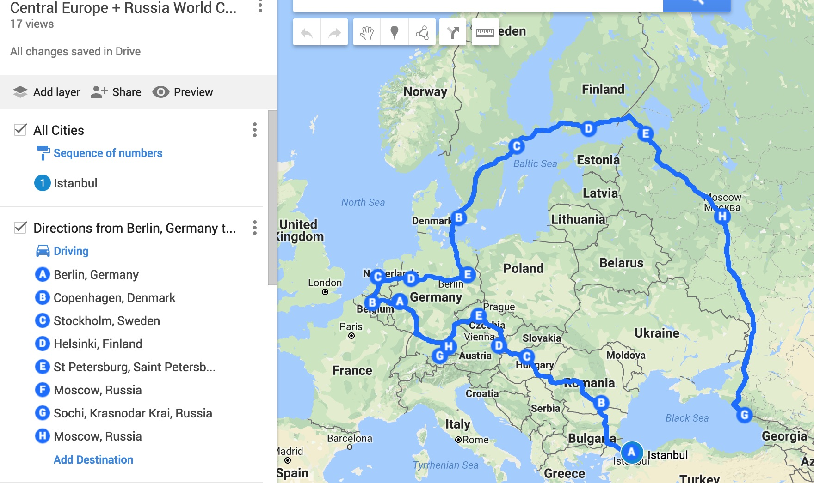

# COMO PLANEAMOS VIAJAR A 18 CIUDADES 12 PAÍSES

Ultimamente he estado leyendo muchos blogs de viajes y me he dado cuenta que las experiencias de los demás es útil y valiosa, los consejos y tips que he visto me ha ayudado a preparar y planear nuestro viaje.

## Cuando decidimos hacer el viaje

Cuando Peru clasificó al mundial, lo pensamos y dijimos seria bonito ir, recuerdo fue un sábado en la mañana, cuando nos enteramos que Peru y Australia están en el mismo grupo; ahi supimos sin lugar a duda que no había nada que esperar y en Diciembre del año pasado en mi cumpleaños compramos los pasajes aéreos de ida y vuelta .

## Decisiones Iniciales

Decidir donde quieres ir y que quieres conocer es crucial, pero no es de la noche a la mañana, cuando compramos los tickets siempre comenzamos en una ciudad y regresamos por otra; lo que va en el medio lo vamos decidiendo poco a poco .  
Tiempo : 4 semanas  
Inicio : Estambul  
Final : Moscú  
Que hacer: Ver el partido de Perú – Australia

## Momentos difíciles

-   Primero gastar, cada vez que nos sentábamos a comprar pasajes es terrible ver que hay tanto que pagar, pero cabe decir que en un periodo de mas o menos 6 meses hace que sea mas llevadero.
-   Lo segundo difícil fue conseguir los tickets del partido, no los conseguimos en el sorteo, ni cuando abrieron la primera venta, ese día estuvimos desde las 8 de la noche hasta las 2 de la mañana para conseguir los tickets y nada; fue super frustrante. Cuando abrieron por tercera vez teníamos 3 pantallas de las cuales solo una avanzó y cuando entramos pudimos comprar las entradas que queríamos.

## Desiciones Finales

La idea es comenzar en Estambul e ir subiendo por Europa Central Bucarest (mi hermana me hablo del castillo de Dracula y lo marcamos como lugar que queremos ir ) Budapest (2 ciudades en 1), Viena, Praga, Munich ( vi una foto del castillo de Neuschwanstein y lo adicionamos a nuestra lista), Cologne, Bruselas, Amsterdam, Osnabruck (tengo una amiga que vive allí), Berlin, Copenhagen, Stockholm, Helsinki, St Petersburg, Sochi y finalmente Moscow. Me he aprendido los nombres de memoria por tantas veces que lo he visto, he leído de cada ciudad, visto videos, y estoy siguiendo en instagram algunas cuentas de cada una de las ciudades para ver las fotos que quiero tomar; es una forma de viajar y de conocer los sitios de antemano, por el momento todo esta entremezclado en mi cabeza; espero que en el viaje podamos ver todo lo que sea posible, se que no se puede planear todo, siempre hay cosas inesperadas, como en nuestro viaje a Vietnam que tome agua de caño para lavarme los dientes y me dio una gastroenteritis que me puse tan mal que vomite en el avión y no había bolsa de papel en el asiento de adelante … bueno bueno continuemos con el tema de hoy, aquí esta la foto del mapa que seguiremos .

## Tren, avión, Ferry

La mayoría de los tramos internos los haremos en tren, algunos en avión como de Estambul a Bucharest, y de Bucharest a Budapest también de Berlin a Copenhagen (hay veces que sale mas barato volar que ir en tren y también es importante tener en consideración el tiempo) Habrán tramos que lo haremos en tren toda la noche como de Viena a Praga y en Ferry también de Stockoholm a Helsinki y de Helsinki a St Petersburg.

## Hoteles

Tenemos una teoría, si estaremos en una ciudad por solo un día nos quedamos en un hotel de preferencia en el centro de la ciudad, si es mas de 2 días es mejor un Airbnb, asi tienes mas tiempo de viajar, generalmente los Airbnbs son mas alejados pero tienes cocina y lavadora .

El único lugar que no seguimos este consejo es en Rusia, hemos decidido quedarnos en hoteles. Como es el mundial no pudimos conseguir mucho en el centro de la ciudad, los precios se han disparado, pero tratamos de conseguir lo mas cómodo posible.

Ser turista no es fácil, hay que despertarse temprano, caminar bastante, encontrarse con montones de turistas queriendo tomarse fotos en los mismos lugares que tu quieres tomar tus fotos, tratar de que no te roben, engañen con los precios, pero al final del día sientes que has aprendido bastante, visto lugares tan bonitos, recuerdos que duraran por años.