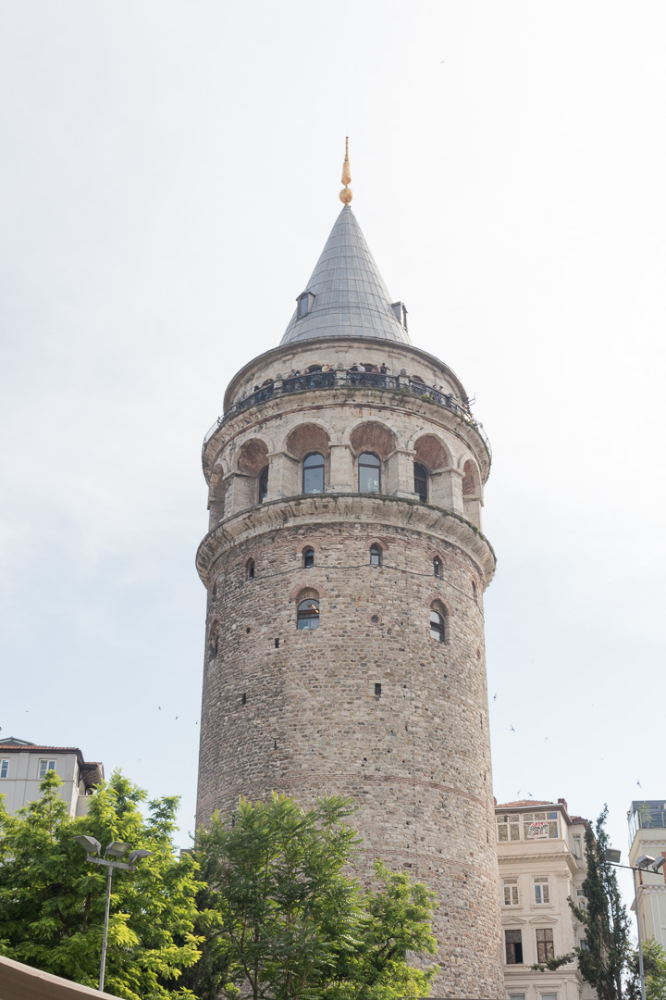
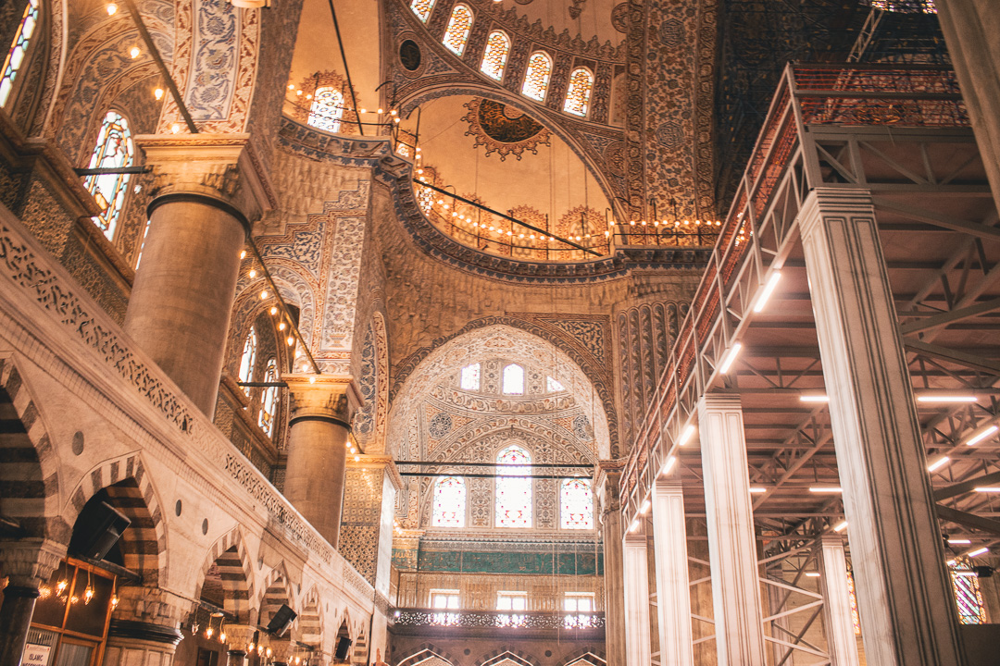
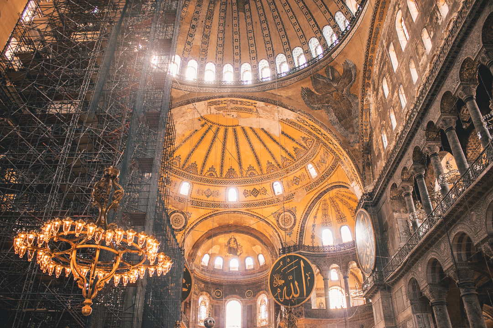

# CONOCER ESTAMBUL EN 2 DÍAS

La primera parada de nuestro viaje fue Estambul, en este post mostrare en detalle lo que hicimos en 2 días, todo nuestro itinerario; Estambul es una hermosa ciudad con mucha historia ; mezquitas con hermosa arquitectura donde la historia se mezcla, un claro ejemplo es Hagia Sofia realmente impresionante!!

## Primer dia

Llegamos al aeropuerto Ataturk en la mañana, compramos la tarjeta de tren y tomamos el tren a la estación de Yenikapi de ahi tomamos taxi a nuestro hotel, al principio tube un poco de preocupación de tomar taxi, ya que los taxistas no hablan ingles, pero la verdad es la mejor forma de ir de un sitio a otro en Estambul. Lo importante es en acordar en un precio desde el principio. Yo seguía la ruta en mi teléfono con mis mapas de google que me había bajado.

-   
    
    Mapa del primer dia en Estambul
    

### Taksim Square

Luego de llegar al hotel y refrescarnos salimos listos a descubrir la ciudad, tomamos un taxi a Taksim square, almorzamos comida turca muy rica por cierto y comenzamos la caminata.

-   
    

### Galata Tower

Caminamos por unas calles grandes llenas de tiendas como la foto anterior, del tipo H&M, nike, etc muchos restaurantes, mucha vida.

### Galata Bridge

Caminamos el puente donde hay pescadores pescando, autos pasando, restaurantes donde preparan pescado frito, realmente una ciudad vibrante donde muchas cosas estan pasando al mismo tiempo.

-   
    
    La torre Galata
    
-   
    
    EL Puente Galata
    

### Eminonu

Al otro final del puente esta Eminonu, una estacion importante con muchos restaurantes hasta llegar al gran Bazaar, algunos restaurantes son barcos antiguos.

-   
    

### El gran Bazaar

Es un centro comercial tipo mercado, venden ropa, recuerdos turcos, y en una esquina habian cafeterias decoradas muy bonitas, paramos por un cafe/te torta; regresamos al hotel en taxi super cansados

-   
    
-   
    
    Grand Bazaar
    
-   
    
-   
    

## Segundo dia

Tomamos desayuno en el hotel, tomamos un taxi a lo que podria decirse el centro de la ciudad

### El hipodromo

Es una plaza central donde en tiempos romanos era el lugar de carrera de caballos y carrozas, luego en tiempo bizantino se convirtio en el centro de la ciudad tambien hay un obelizco de egipto, asi que es una plaza llena de diferentes tiempos.

  
Antes del viaje vimos una novela Kara para Ask, en la plaza central esta el lugar donde grabaron la novela “la comisaria de Omar” estaba cerrado pero entramos, tomamos fotos hasta que llego un policia o seguridad nos dijo que no podiamos estar ahi, jeje lo bueno es que ya habiamos acabado con tomar las fotos.

-   
    
-   
    

### La mezquita azul o the Blue Mosque

Esta abierta desde temprano y es gratis, asi que pudimos entrar, tiene 6 torres tiene el techo azul, la gente va a orar y los turistas a tomar fotos. Fue construida en 1616, famosa por el hermoso trabajo de su techo . Aqui una foto por fuera y por dentro y las reglas para poder entrar:

-   
    
-   
    
-   
    

### Basilica Cisterna

Abren a las 9 de la mañana; es una reservorio de agua subterraneo contruido en el tiempo romano, dentro de el hay 2 cabezas de meduzas realmente impresionantes. Una vez dentro busca las 2 cabezas de meduza gigantes.

-   
    
    Reservorio de Agua
    
-   
    
    Cabeza de Meduza
    

### Hagia Sofia

En caso solo tengas tiempo de ir a un solo lugar en Estambul te recomiendo que no te pierdas Hagia Sophia.

Hagia Sofia fue contruida en el año 360, Por 900 años fue la Catedral Ortodoxa bizantina, luego entre 1204 y 1261 fue reconvertida en catedral católica , En 1453 cuando los Otomanos conquistaron Constantinopla, Hagia Sophia fue convertida en una mezquita, ahora es un museo, en las paredes de esta iglesia se puede ver el paso del tiempo se puede ver las pinturas de la virgen de la iglesia original mas las decoraciones islamicas, realmente un lugar impresionante.

-   
    
-   
    
-   
    

Para la tarde teniamos planeado ir al palacio de Tokapi pero martes esta cerrado. Asi que cambiamos de planes, fuimos a tomar un tour en barco por el Bosphorus, Estambul es la unica ciudad en el mundo que pertenece a 2 continentes. Estambul se encuentra ubicada entre Europa y Asia, asi que este tour en el barco fue muy interesante

-   
    
-   
    

Al dia siguiente salimos del otro aeropuerto Sabiha Gokcen, fuimos nuevamente a la plaza de taksim, de ahi hay buses directos que llevan al aeropuerto, salen buses cada 15 minutos, el viaje al aeropuerto toma casi 2 horas, asi que hay que salir con tiempo.

-   