# LUGARES PARA VISITAR EN BUCAREST – RUMANIA

Debo decir que Bucarest me gusto mucho, sobrepaso mis expectativas, hay tanto que ver, es una ciudad con muchas gemas escondidas.

De Estambul tomamos un vuelo hacia Bucarest, porque el viaje por tren nos pareció complicado y no hubiéramos dormido bien mejor un viaje corto de 1 hora mas llegamos en la mañana, tomamos el bus 783 que nos llego al centro de la ciudad, donde nuestro hotel se encontraba.

## Lo que mas me gusto en Bucarest :

### Columna de trajano

La columna de Trajano se encuentra en el museo nacional de Historia de Rumania, esta columns contiene en dibujitos la historia del emperador Trajano en las guerras Dasias. Esta es una replica de la que hay en Roma. En la entrada buscábamos la estatua de trajano llevando un lobo, pero no, preguntamos nos dijeron que lo habían retirado por bandalismo y que era muy probable que no lo regresarían.

-   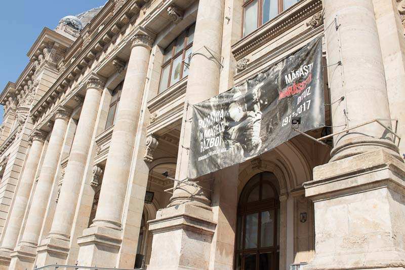
    
-   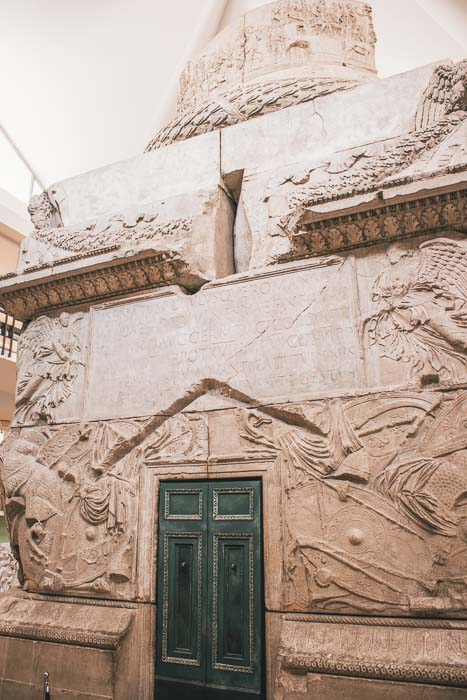
    
-   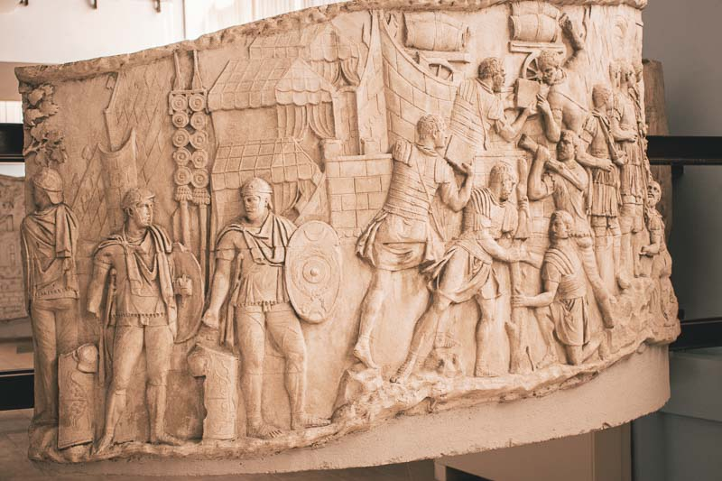
    

### Hermosos pasajes

En Bucarest hay muchos pasajes escondidos con restaurantes y cafes, aquí unas fotos del pasaje Villacrose y pasaje victoria, muy bonitos para tomar fotos.

-   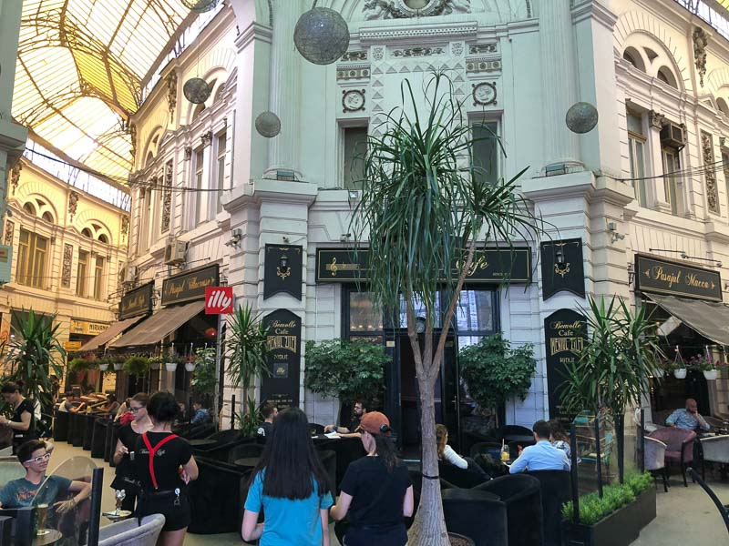
    
-   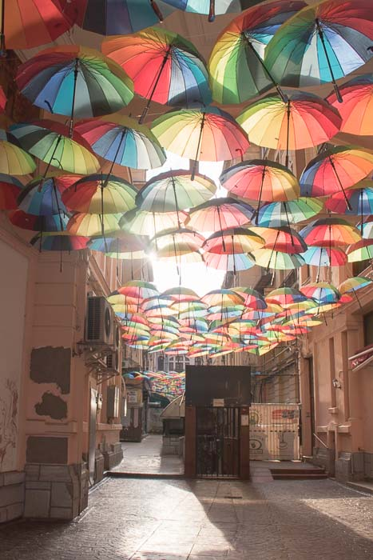
    

### Edificios del gobierno

En el centro hay varios edificios del gobierno, los que mas me gustaron fue el Palacio del parlamento rumano, es mas grande de lo que me imaginaba, es inmenso !!! Es el segundo edificio mas grande, primero es el pentágono.

-   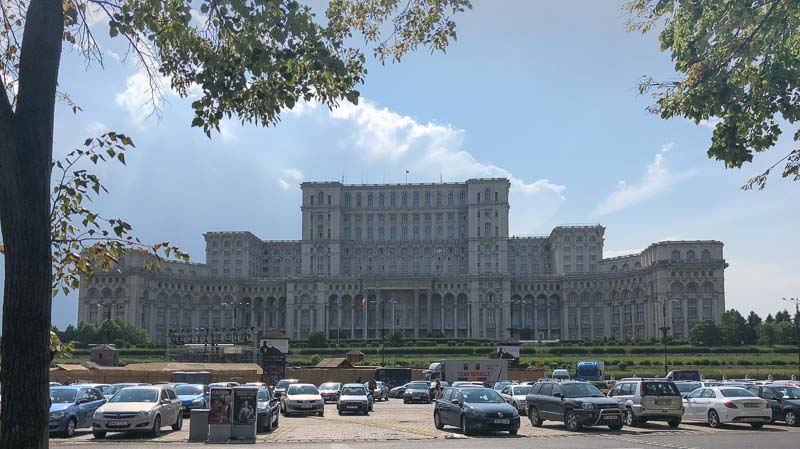
    

El otro es el palacio del depósito y consignaciones, este edificio me pareció muy bonito.

-   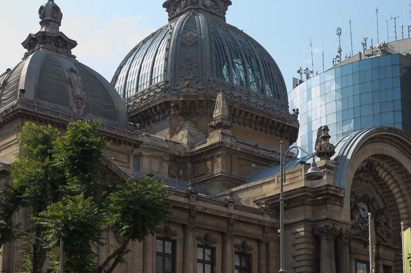
    
-   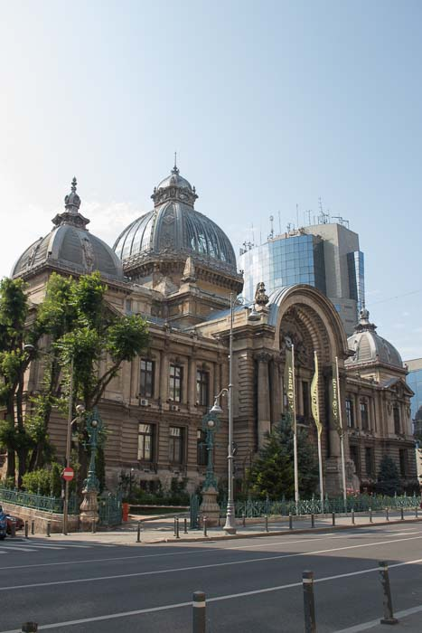
    

### Parques

Me gustaron los parques, la ciudad es limpia con amplios parques.

-   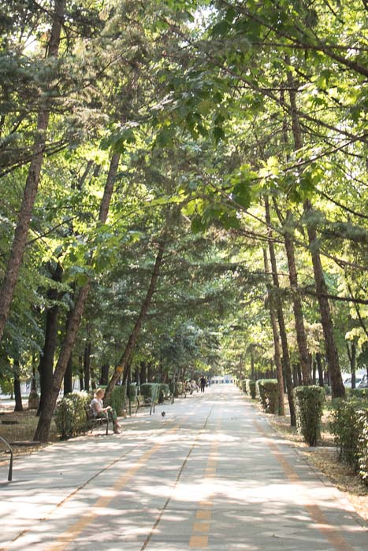
    

### Monasterio Stavropoleos

El nombre _Stavropoleos_ que viene del griego «ciudad de la cruz». Uno de los intereses constantes del monasterio es la música bizantina , por dentro es una belleza, llena de imágenes, el jardín es realmente hermoso con muchas lápidas.

-   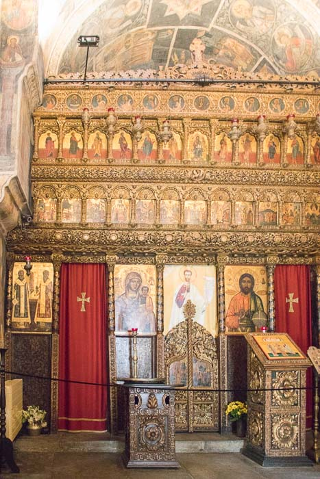
    
-   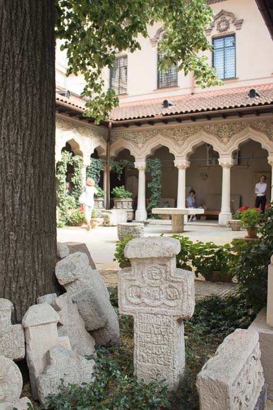
    
-   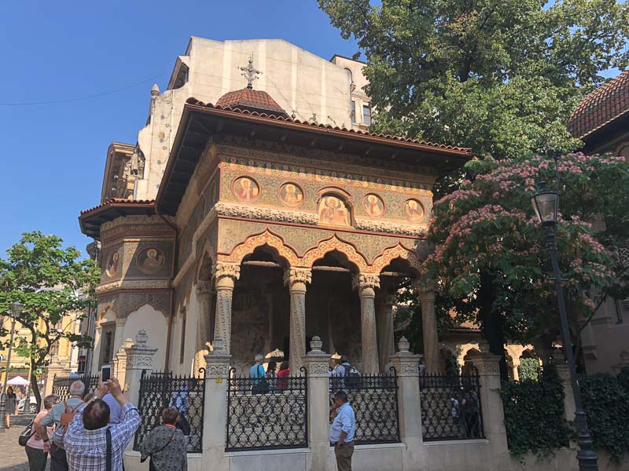
    

### Caru-cu’bere

Cerca del monasterio esta este hermoso restaurante, el ambiente es bastante tradicional y hay bailes en vivo de música tradicional. Se necesita hacer reservación, tuvimos suerte porque no reservé pero nos dieron una mesa dentro, la comida es rica, el restaurante no es barato, pero tampoco muy caro, creo que valió la pena.

-   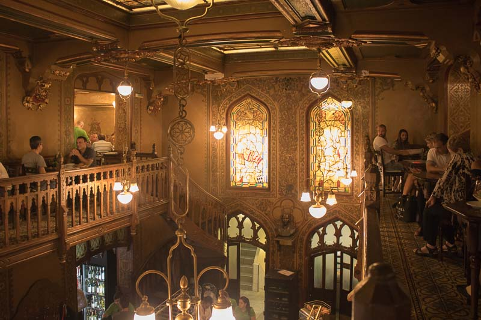
    
-   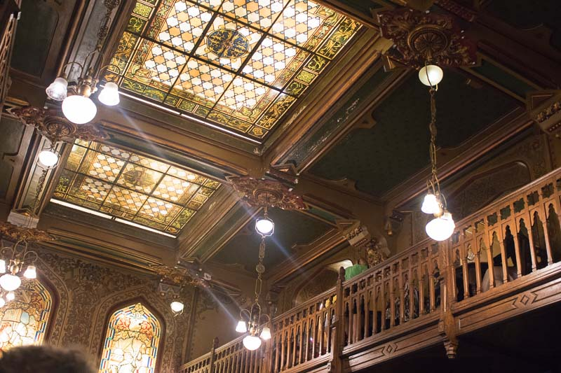
    
-   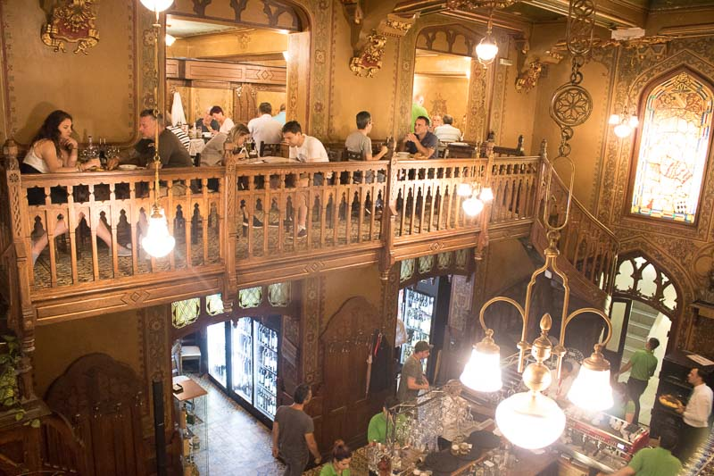
    

### Carturesti

Debo decir que esta librería es mi favorita, la decoración simple , la iluminación bonita, realmente me encantó, el cafe en el cuarto piso es muy bonito como para quedarse horas y horas, lamentablemente no tuvimos mucho tiempo, esta ciudad tiene tanto para ver.

-   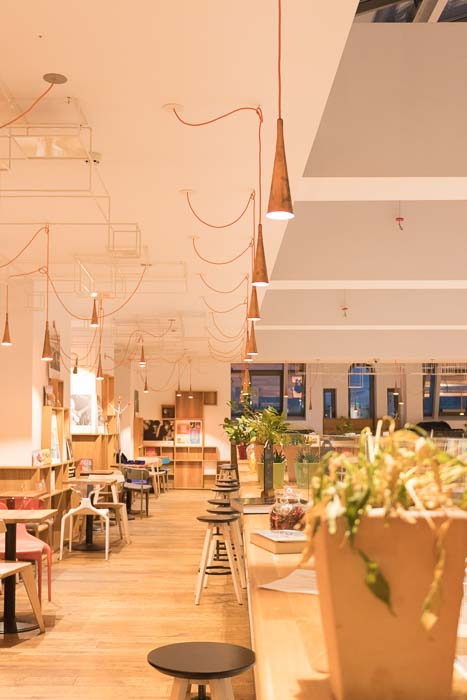
    
-   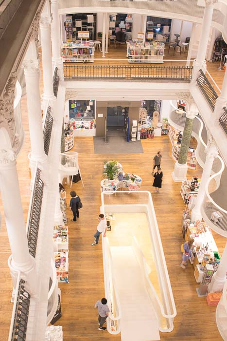
    
-   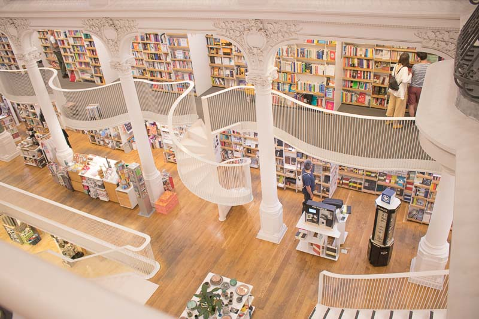