# TOUR EN TRANSILVANIA (CASTILLO DE DRACULA)

Cuando planeaba el viaje le pregunte a mi hermana, ella me dijo: en Rumania tienes que ver el castillo de Dracula y me paso los enlaces de este Tour que en un día visita dos castillos,  [aquí el enlace](http://www.bucharestcitytour.com/Day_Trip_Bucharest_to_Peles_and_Bran_Castles) . Realmente uno de los mejores consejos que recibí en este viaje. Nunca imagine que el castillo de Dracula existia, no sabia ni quien era en verdad. Bueno aquí les muestro lo que aprendí:

El lugar de encuentro del tour fue en frente del Atheneum Rumano a las 8 de la mañana, fuimos un grupo de 15 personas mas o menos, el guía era muy bueno; en el camino de ida nos hablo del comunismo en Rumania de Nicolas Ceausescu, de los cuales habíamos escuchado en el libro de Yuval Harari, Homo Sapiens.

Bueno, regresando al paseo el bus nos llevo al primer castillo:

## Castillo Peles

La primera parada fue Sinaia, el Castillo de Peleş – castillo de verano de la familia real de Rumania; llegamos como a las 10:30 de la mañana. la vista es realmente linda.

El castillo fue construido entre 1873 y 1914 tiene un estilo aleman como se puede apreciar, porque el primer rey que comenzó la construcción este castillo era de origen alemán. Lo que nos dijo el guía era que el castillo fue bastante moderno para su época tenia calefacción central, un ascensor para la reina y electricidad.

Nota: si quieres tomar fotos dentro del castillo hay que pagar adicional, no es mucho, me arrepiento de no haber pagado, es muy bonito por dentro también.

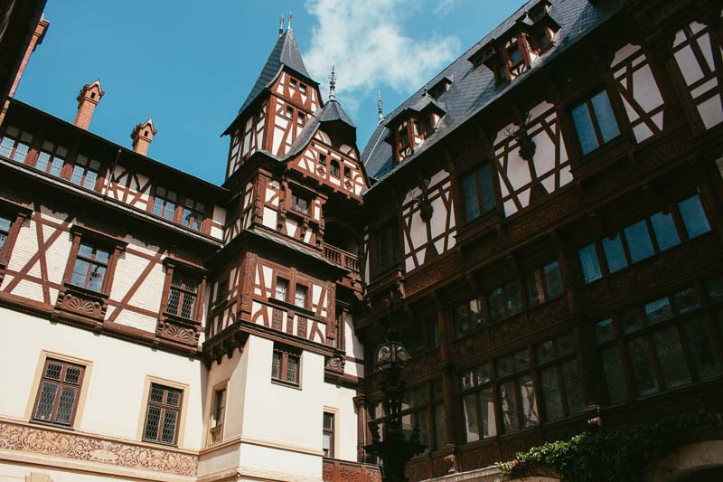 | 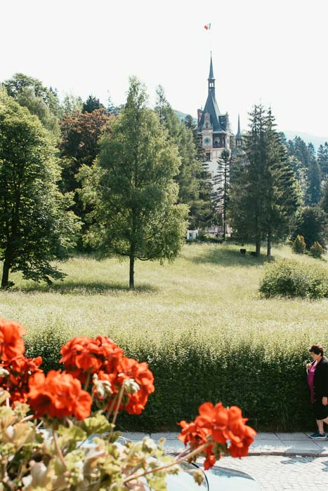
    

## Quien fue Dracula en la vida real ?

Bram Stocker quien escribió el libro de Dracula se baso en  **Vlad Tepes III**, principe de Valaquia, quien lucho con los Otomanos, su sobrenombre fue “Vlad el empalador” .

Su padre fue Vlad Dracul (Dracul significa Dragón en Rumano), como parte de un trato Vlad Tepes y su hermano Radu fueron entregados a los otomanos (turcos) como acuerdo de no agresión al sultan, así creció para convertirse en un monarca temido por sus castigos y empalamientos multitudinarios, se dice que mato entre 40 mil y 100 mil personas.

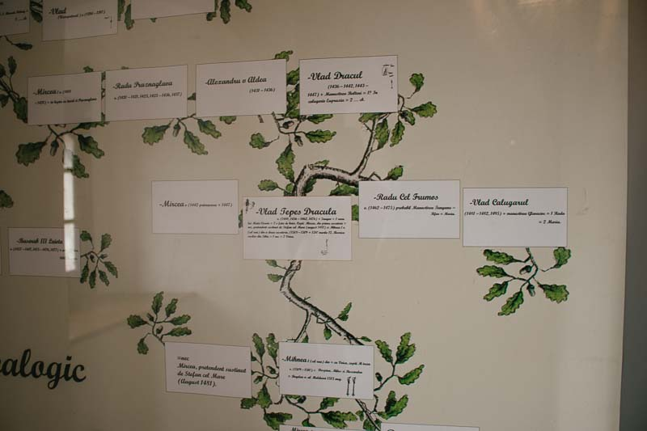 | 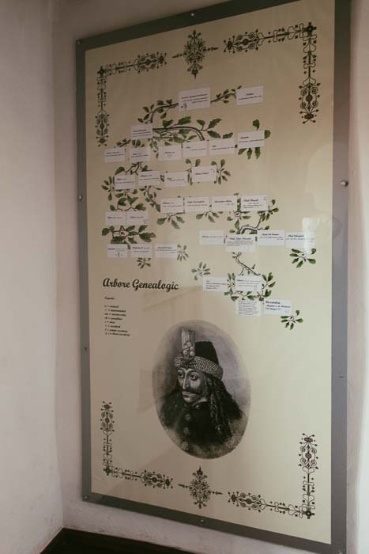
    

## Castillo de Bran

Este fue uno de los castillos de Vlad Tepes, algunos dicen que no hay evidencia que el vivió aquí pero seguro que ahora es un punto turístico, y su aspecto ayudo a elaborar la historia del Conde Dracula.

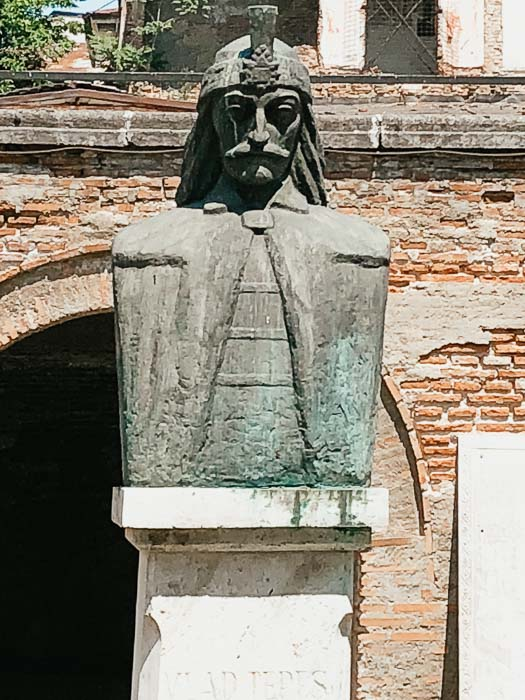 | 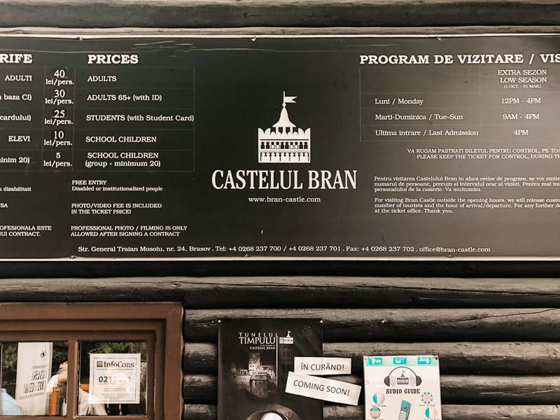
    

El Castillo es realmente hermoso, vale la pena verlo

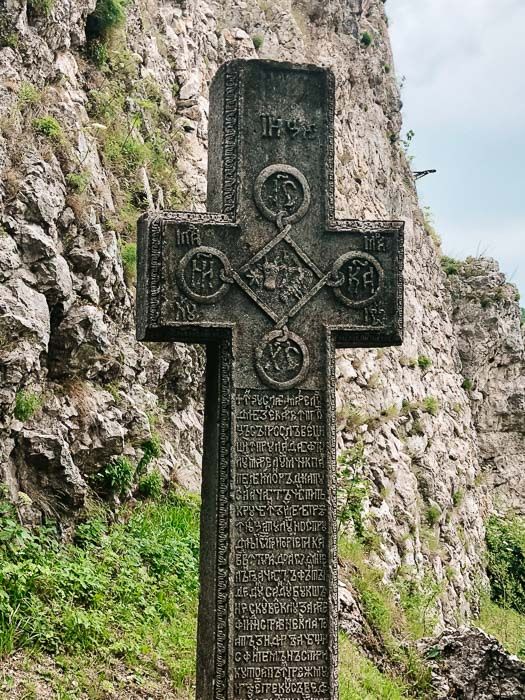 | 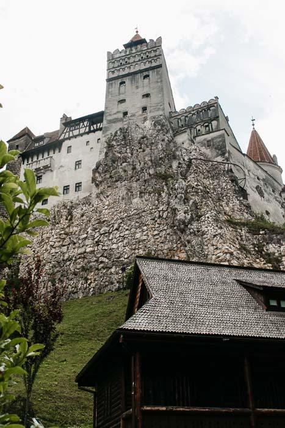
    
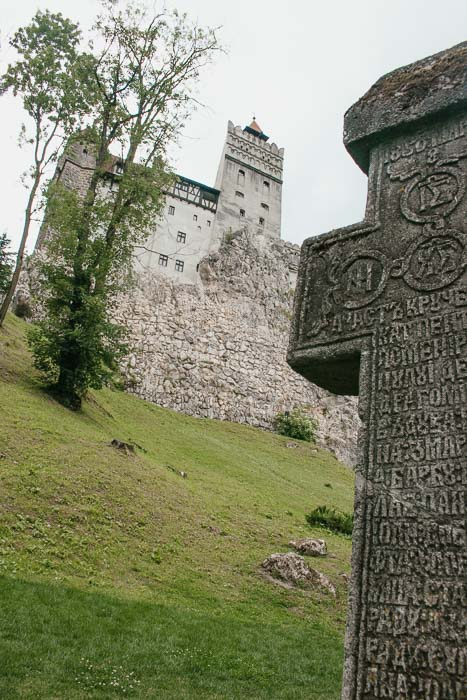
    

Aquí algunas fotos al patio interior y una de las fotos que mas me gusta es la vista del paisaje, vista por una de las ventanas internas.

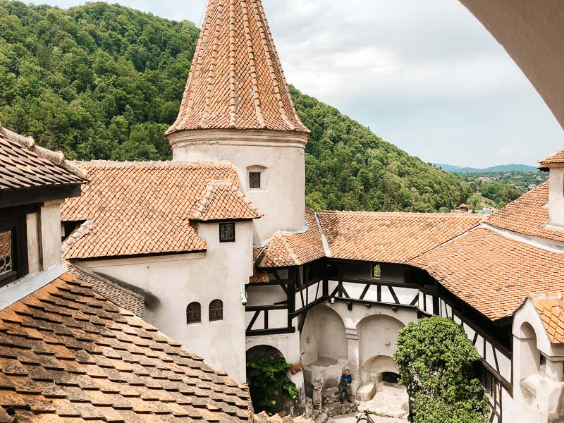 | 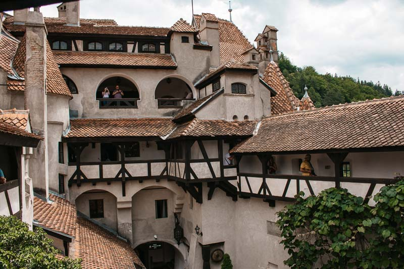
    
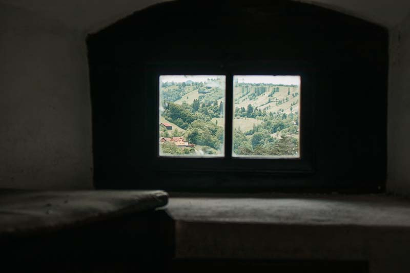
    

## Brasov

El ultimo lugar del paseo fue Brasov, llegamos como a las 3 de la tarde, el guía nos dio un tiempo para que paseemos, la plaza es bonita ,limpia y bastante pintoresca, el día era realmente hermoso.

EL nombre de la ciudad esta en letras blancas en la montaña parecido a Hollywood  🙂

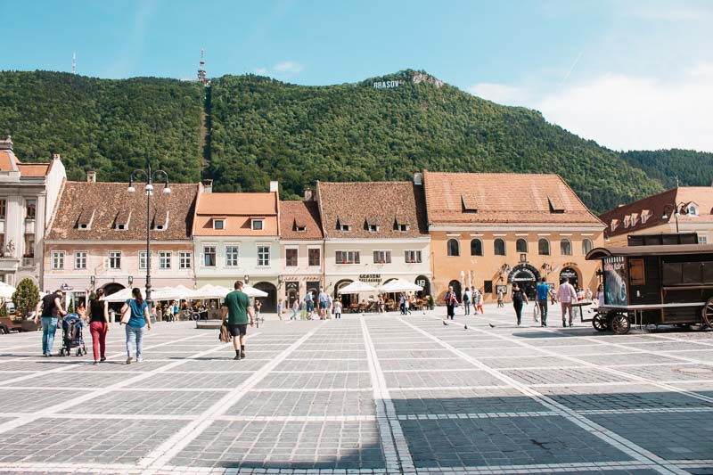 | 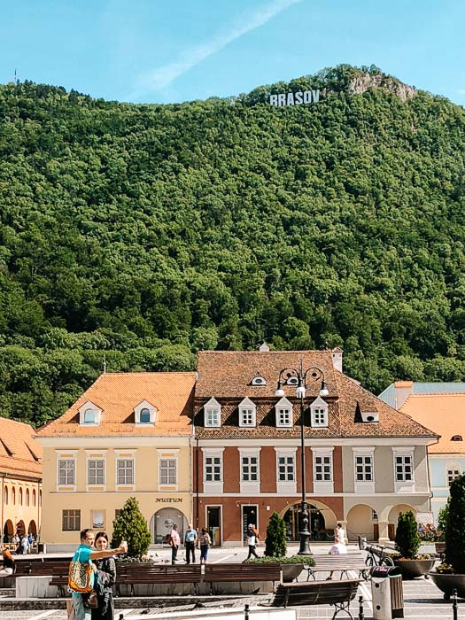
    

Hay ricos helados, super relajado, un bonito paseo, con mucha historia, de ahi regresamos donde todo comenzó, como a las 8 de la noche. El tour realmente fue muy interesante y entretenido.