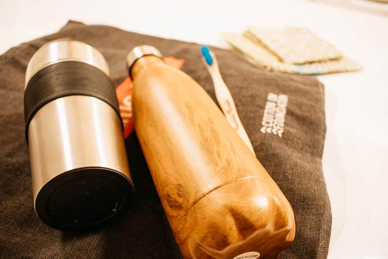
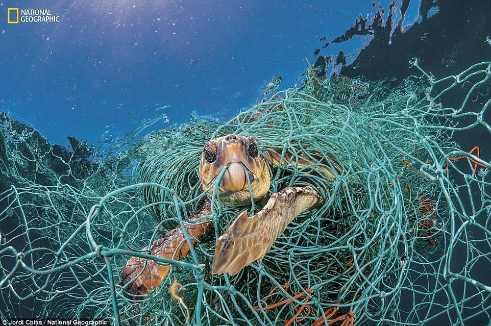
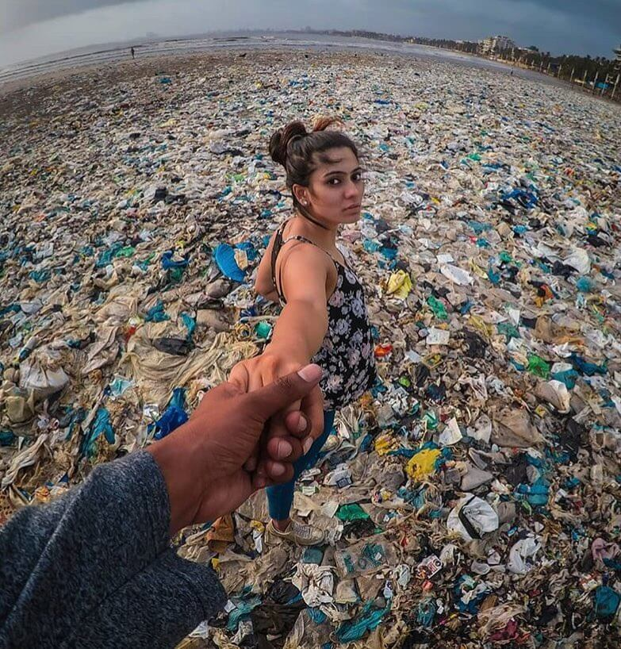

# COMO USAR MENOS PLÁSTICO

### Porque el plastico se ha convertido en un problema?
  
La razón principal es porque se demora cientos de años para desintegrarse, estaba pensando el biberón que usé de bebe aun esta en la tierra sin desintegrarse, talvez enterrado bajo la tierra o flotando en el mar en pequeños pedacitos.

Me sorprendió saber que los globos de helio que usamos en cumpleaños nunca se desintegra y las botellas de plástico demoran 450 años.

No puedo cambiar el mundo lo único que puedo cambiar es mi forma de consumir plástico y tratar de evitarlo, el plástico esta en casi todos los productos, desde la pasta de dientes que usamos, las bolsas que compramos, todo se empaqueta en plástico, el shampoo que usamos, se que evitarlo 100% es casi imposible, pero  **nuestra voz es lo que consumimos como individuos.**

### Que hago para evitar usar plastico:

1.  Siempre llevo conmigo mi bolsa reusable, cuando llego a casa guardo las cosas y mi bolsa reusable la pongo en mi cartera, sino me olvido.
2.  Llevo mi tasa de metal en mi bolsa, cuando compro mi cafe les doy mi tasa de cafe para que la llenen.
3.  Cuando me van a dar una cañita digo no gracias
4.  Cuando voy al mercado llevo mis bolsas
5.  Cuando como fuera, voy por la opción que usa menos plásticos, difícil lo se, este punto es “trato” no siempre lo encuentro. por ejemplo si compras sushi viene con sus pecesitos de sillau .
6.  En el supermercado busco el producto que compro tenga menos plastico, tambien en la categoria de “trato”.
7.  Los envoltorios de cera de abeja, desde que lo tengo ya no use el plastico para cubrir sobras de comida en la refrigeradora.
8.  Cepillo de dientes de madera… en este punto debo decir que también tengo el electrónico, los alterno un tiempo uso uno, otro tiempo el otro.  
    

-   
    
    Los productos reusables que uso : botella de agua, taza de cafe/te, cepillo de dientes, bolsas reusables, envoltorios de cera de abeja
    

Aqui 2 imágenes que muestran que el problema del plástico no es algo del futuro, esta pasando ahora, nuestra fauna marina esta consumiendo los micro plásticos (el plastico no se desintegra sino que se rompe en miles de pedacitos) los peces comen ese plástico, lo cual hace que nosotros consumamos ese plástico al final.

 | 

Hay muchas iniciativas como consumir menos plástico en Julio, no se porque Julio pero bueno @plasticfreejuly en instagram.

En nuestra búsqueda por mejorar nos damos cuenta que nuestras costumbres afectan no solo a nosotros sino al mundo que nos rodea, no creo que es fácil de un momento a otro decir que no consumiré mas plástico, creo que es imposible para mi, pero lo que si puedo es minimizar mi consumo de plástico,