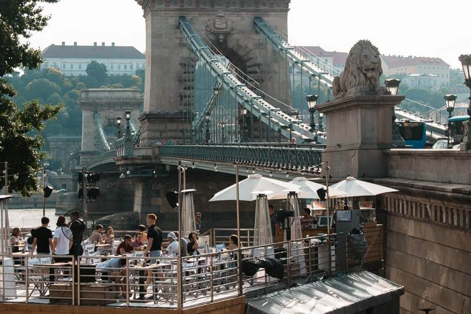

# QUÉ VER Y HACER EN BUDAPEST

Continuando con el viaje llega el turno a una ciudad que me gusto mucho: Budapest, Hungría en este post les mostrare porque.

De Bucharest volamos a Budapest, les recomiendo que si viajan por Wizz hagan el check in por internet, nosotros no lo hicimos y nos cobraron casi como un pasaje mas, fue un vuelo de 1 hora muy parecido al anterior.  
Del aeropuerto tomamos el bus a nuestro hotel

## Brody Hotel

Nuestro hotel fue Brody house, nos gusto mucho este boutique hotel, tiene ese ambiente antiguo pero cómodo, realmente una experiencia interesante, totalmente la recomiendo ;  [el enlace a su instagram](https://www.instagram.com/brodyhouse/)  , tambien  [aquí](https://www.brody.land/accommodation/)  el enlace a su pagina web.

en esta mesa tomamos nuestro desayuno al llegar

## Baños termales Szechenyi

En Budapest hay varios baños termales para escoger, pero creo que uno de los mas grandes y conocido son los baños de Szenchenyi, asi que tomamos el tren en la mañana era un día caluroso de verano, una de las piscinas exteriores si que era caliente. La piscina interna era menos caliente super relajante .  

-   
    
-   
    
-   
    
-   
    

## Mercado Central

Llegamos con mucha hambre, en el segundo piso hay unos restaurantes típicos, comimos un tipo de estofado, el mío fue vegetariano, lamentablemente no le tome foto, pero era como comida casera rica. Esta es una de las comidas que mas recordamos del viaje.

-   
    
-   
    
-   
    

## Puente de las cadenas

Budapest es en verdad 2 ciudades, Buda y Pest el puente de las cadenas (en húngaro oficialmente, _Széchenyi lánchíd_) une las dos ciudades

## Funicular al Castillo Buda

Subir a la colina del Buda hay que tomar un funicular con una hermosa vista del puente de las cadenas,  [aquí precios y horario de atención del funicular .](https://www.disfrutabudapest.com/funicular)Nosotros compramos los tickets ahi mismo, no por internet.

-   
    

## Bastion del pescador

El **Halászbástya** o **Bastión de los Pescadores** es una terraza de estilo neogótico situada en la orilla de Buda del rio Danubio, en la colina del castillo real de Budapest, Hungría.

-   
    
-   
    

## Iglesia de Mathias

Frente al bastion hay una iglesia muy bonita con techos antiguos realmente toda esa area es hermosa, la iglesia, el bastión y la vista del parlamento

-   
    
-   
    

## Parlamento

El parlamento mas lindo que haya visto, realmente impresionante con el Danubio en frente, estuvimos en el atardercer, creo que es hermoso en todas las luces, he visto fotos de noche también se ve espectacular.

Desde el bastión del pescador tome la ultima foto, no importa de donde tomes la foto, siempre sale impresionante.

-   
    
-   
    
-   
    

## El tren

Debo hacer una pausa aquí para decir que a estas alturas del día mis pies estaban bastantes adoloridos mas el calor que hacia, quien dijo que ser turista es fácil, pero cuando ves estas bellezas de vistas panorámicas que en persona son mas espectaculares que en las fotos, te dices, si vale la pena. Lo que pudimos nos movilizamos en tren generalmente pero caminamos bastante este día.

