# VIENA EN UN DÍA

Decidimos estar en Viena por un día, no dormimos porque tomamos el tren que viaja toda la noche a Praga; dejamos nuestras maletas en la estación y salimos a pasear.

## Estación de Karlsplatz

Viena es una ciudad bonita, bonitas casas, bonitas estaciones nuestra primera estacion fue Karlsplatz

-   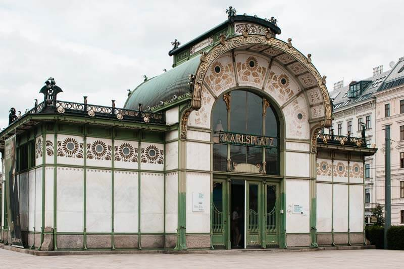
    

## Iglesia de San Carlos

En una de las esquinas del paque de Karlplatz encontramos esta hermosa iglesia con 2 columnas muy parecidas a las columnas de trajano que vimos en Bucarest.

-   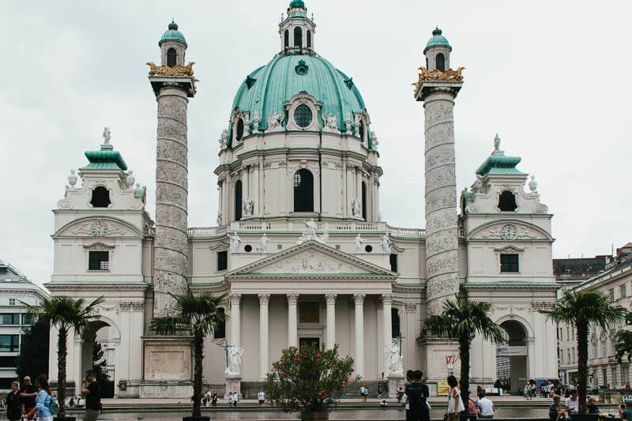
    

## Luces rojas

Los semáforos de Viena tienen 2 personitas 😃

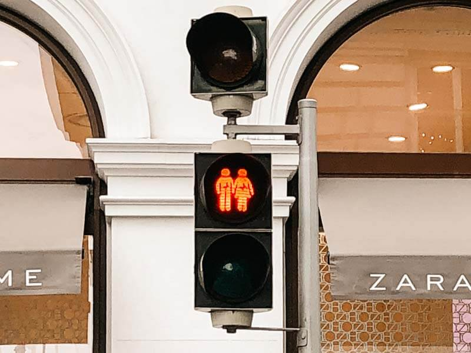 | 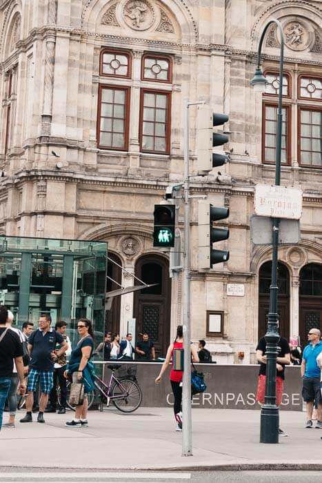
    

## Biblioteca Nacional de Austria

Esta biblioteca vale la pena visitar, es realmente impresionante, la cúpula al centro, los dibujos de la cúpula parece una iglesia, los libros en armarios tallados de madera, la estatua de marmol de Carlos VI en el centro.

 | 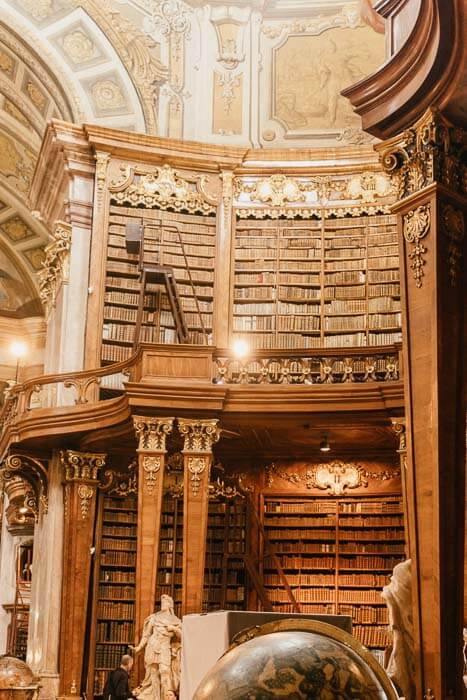
    
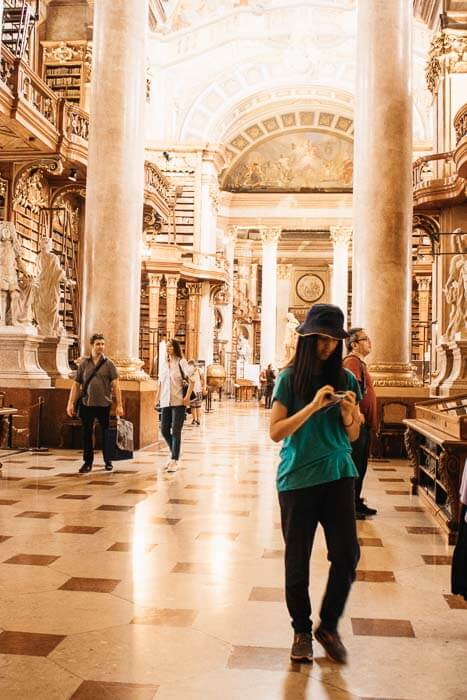 | 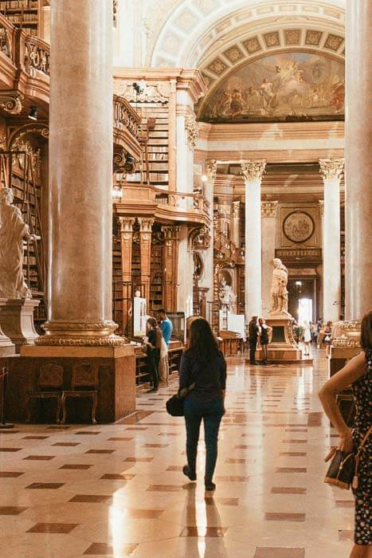
    

## Hermosos parques

El dia estaba nublado y de rato en rato llovia un poco, me gusto la caminata que hicimos cruzamos un lindo parque con arboles gigantescos, me gusta esta foto de este arbol.

-   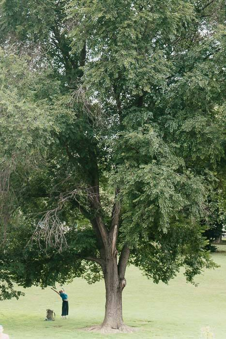
    

## Cafe Central

Muchos bloggers de viajes recomendaban este Café Central, hay que hacer cola para entrar, felizmente no era muy larga, mientras haces la cola para entrar puedes ver los caballos pasar.

Entrando esta esta estatua de [Peter Altenberg](https://en.wikipedia.org/wiki/Peter_Altenberg) un escritor y poeta de Viena, pedimos chocolate, el pastel de manzana, todo muy rico.

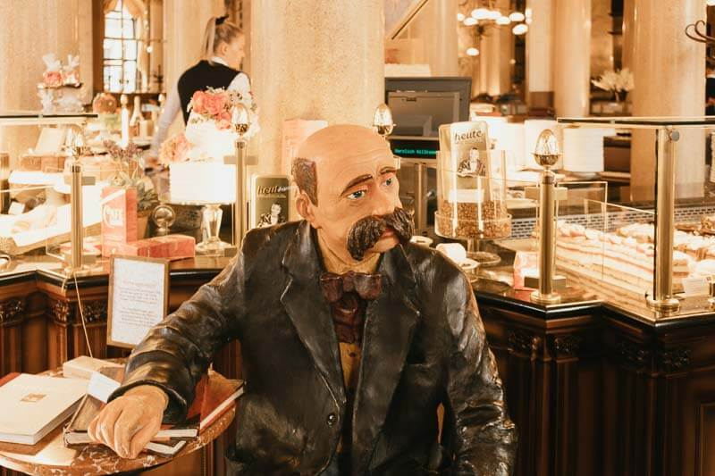 | 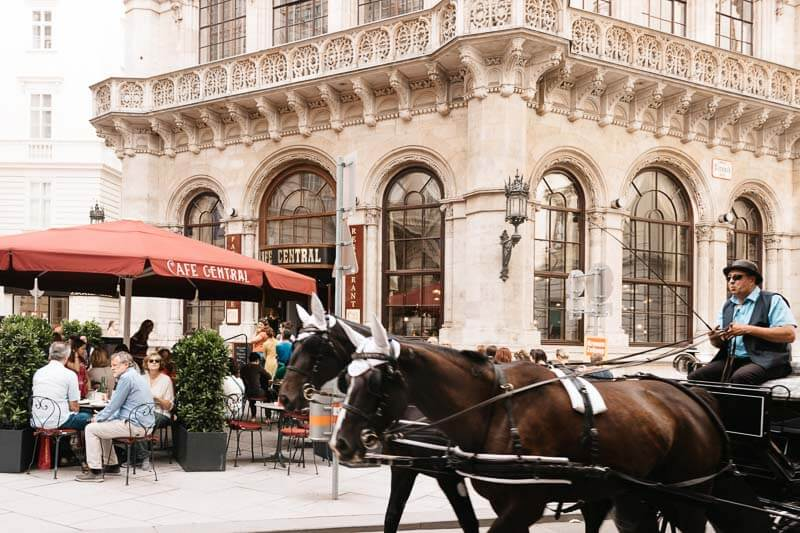
    
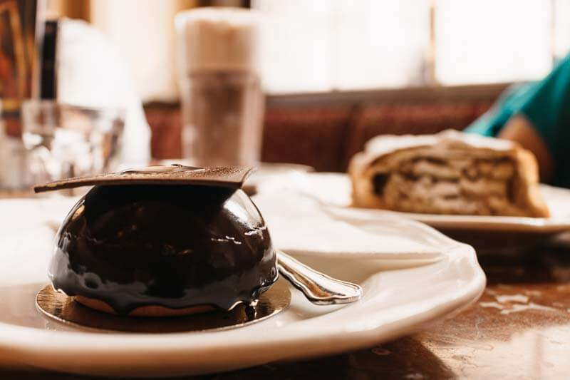 | 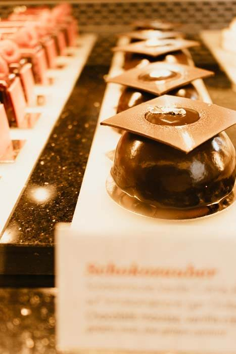
    

## Caballos

En la ciudad puedes ver estos hermosos carruajes de caballo, lo cual lo hace mas pinturesco, realmente hermoso caminar por el centro de la ciudad .

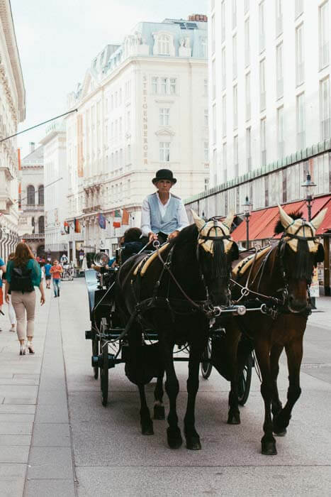 | 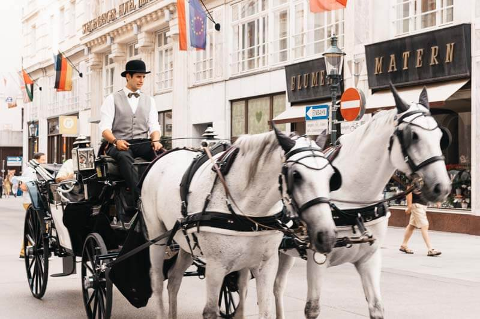
    

## Palacio Schobrumn

Reservé entradas para este palacio con anticipación, nuestras entradas eran de 15:00 a 15:30 así que luego del cafe fuimos en tren al palacio, no dejan tomar fotos por dentro, es muy bonito, hubo una reina conocida con el nombre de Sisi . Mas caballitos !!!

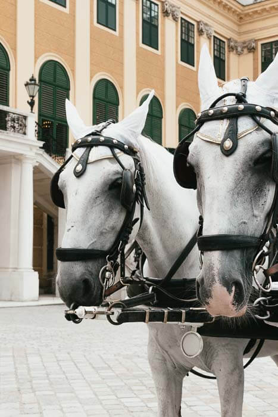 | 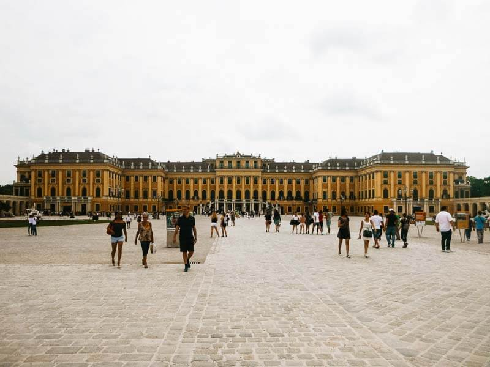
    

## Hunderwassen House

Este lugar fue opcional, como tuvimos mas tiempo del que pensé fuimos a ver este edificio por fuera, el cual no nos pareció tan interesante. Bonito si para las fotos, pero no wow.

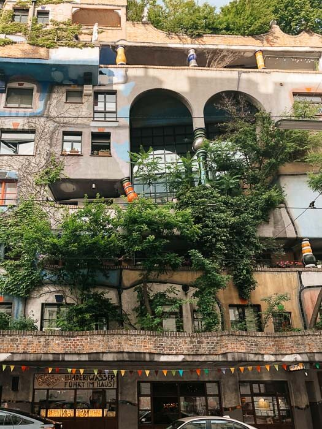 | 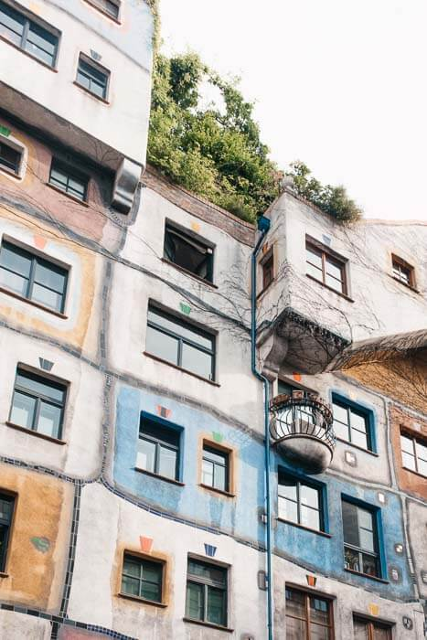
    

## Catedral de San Esteban de Viena

Está situada en la [plaza de San Esteban (Stephansplatz)](https://es.wikipedia.org/wiki/Plaza_de_San_Esteban_(Viena))

-   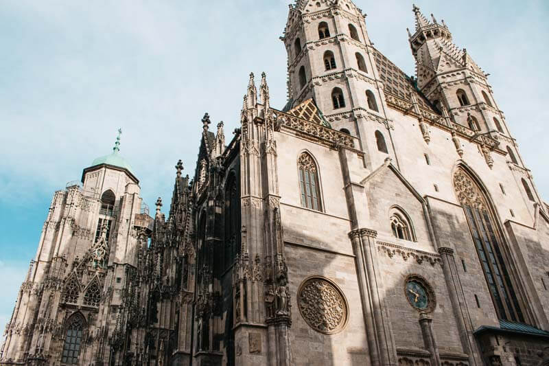
    

## Restaurantes

Hasta Burger king tiene un edificio bonito, como puede ser eso?? miren el techo de este Burger King

## La casa de Mozart

No llegamos a tiempo para entrar solo lo vimos de afuera

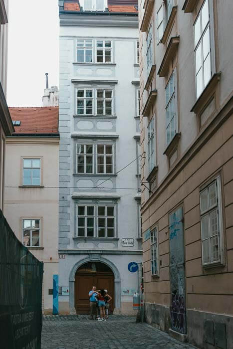 | 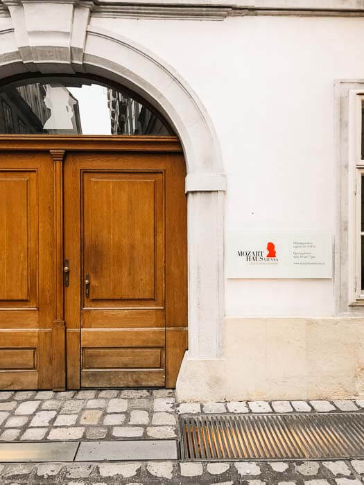 | 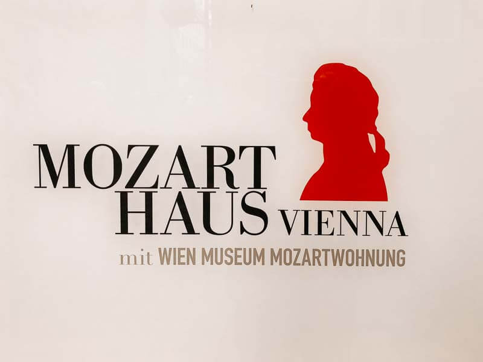
    

Ahora que lo veo en un solo día hicimos bastante .