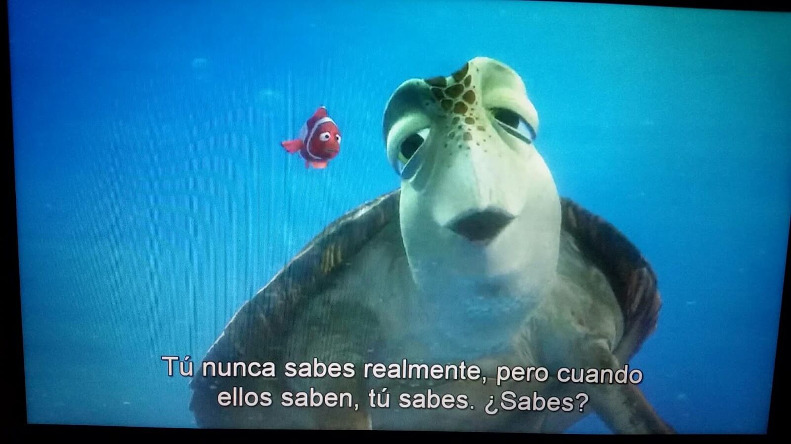

# CUANDO LOS HIJOS CRECEN

Mi hija es pequeña, esta terminando primaria y hace unos días ella se fue con su colegio a una excursión a otra ciudad por 3 días, fue una experiencia nueva para nosotros porque por primera vez ella iba sola con el colegio a un paseo.

## Antes del Paseo

Tube pesadillas meses antes del viaje, y cuando la fecha se acercaba sentía la preocupación; mi mente se llenaba de preocupaciones, de si pasa esto o lo otro, cuando llego el día trate de evitarlo, decirle que no vaya, estaba tosiendo así que eso validaba mas mi teoría de que no tenia que ir.

## Momento de decidir

Cuando trataba de convencerla de que se quede en mi mente estaba la película de Nemo, Marlin le pregunta a la tortuga Crush, cuando sabes que es momento que están listos para ir? y Crush le dice: “Tu nunca lo sabes realmente, pero cuando ellos lo saben, tu lo sabes”… bueno dentro de mi sabia que ella estaba lista, pero yo no. Fue difícil para mi verle ir .. pero lo hice… ni que decir de los 3 días ; fueron duros, trate de mantenerme ocupada y pensar que faltaba poco.

-   
    
    Buscando a Nemo – Pixar
    

**Confiar**  que las cosas van a estar bien no es fácil, a diario vemos las noticias, malas noticias en general nos deja con poca confianza de las cosas van a estar bien y mas cuando hablamos de la seguridad de nuestros hijos.

## Después del Paseo

Ella paso unos 3 días muy bonitos, regreso con muchas historias de lo bonito que lo había pasado, nos extraño y nosotros a ella, es parte de crecer dejarlos ir,  **de confiar que todo estará bien**, de que cada experiencia que tenemos a la larga es lo que nos enseña en formar nuestro carácter.

Se que en esto de ser padres, aun tengo mucho que aprender y que hacer, y que cada año que pasa se pone mas complicado, en mis tiempos no había mucho de esto de excursiones y paseos, para mi eran paseos a Chosica y el mismo día nada de quedarse a dormir allí; hay mucho que aprender y una de ellas es que las cosas no son iguales.