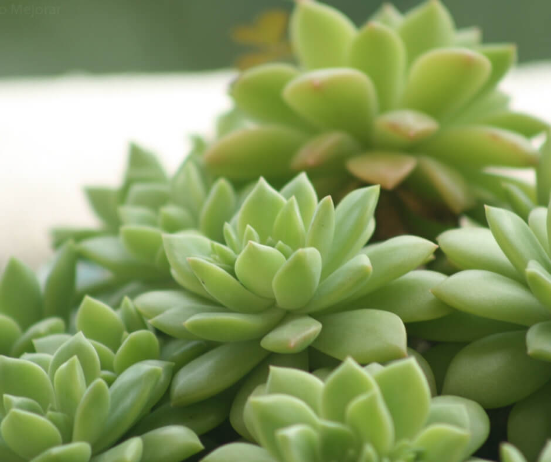
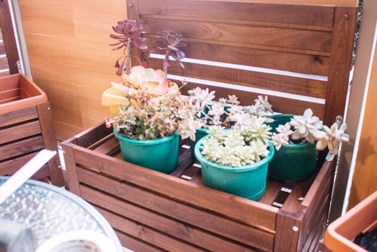
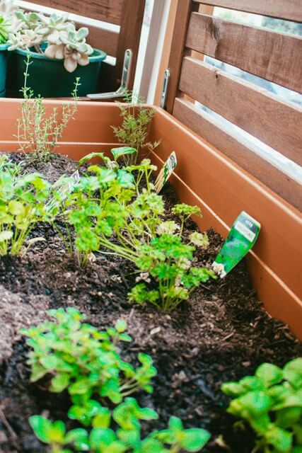
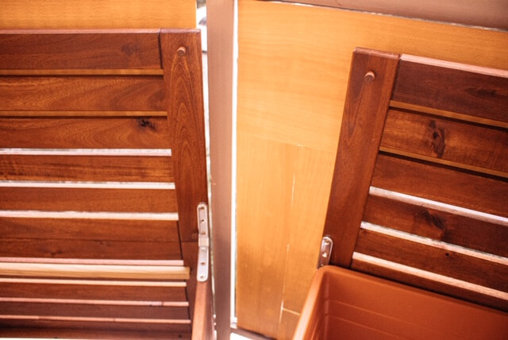
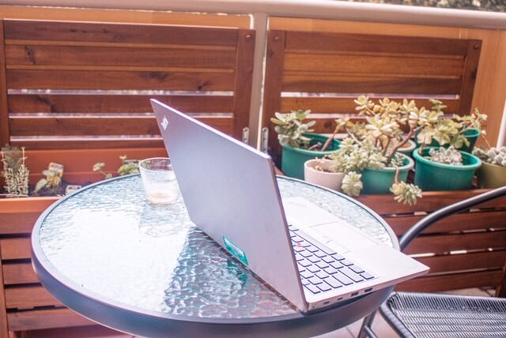

# COMO DECORAMOS NUESTRO PEQUEÑO BALCÓN

Tenemos un pequeño balcón en nuestro departamento el cual recibe el sol en las tardes, no lo usábamos mucho porque no tenia privacidad, las lunas son de vidrio, en el balcón tenía suculentas en maceteros, una de ellas se hizo famosa en la foto de mi post de 5 razones para ser minimalista, me gustan las suculentas porque no requieren mucha agua y son fáciles de cuidar.

Por buen tiempo siempre tuvimos la idea de tener mas plantas comestibles como hierbas para cocinar, así que en la semana de navidad decidimos arreglar el balcón, aqui les mostraré como lo hicimos:

 | 
    

### Que queríamos conseguir con este proyecto

1.  Que el balcón tenga mas privacidad; el objetivo es salir a tomar un cafe por las mañanas sin que nadie nos viera de la calle .
2.  Crecer nuestros vegetales, comenzar por lo mas fácil: hierbas para cocinar tales como orégano, romero, albahaca, perejil, culantro, eneldo, etc. Y también tomates y lechugas.
3.  Mantener mis actuales plantas (suculentas), pero ponerlas mas a la vista ya que en el piso no se les podía apreciar mucho.

## Pasos a Seguir :

Luego de pensar y comprar otros maceteros que terminamos devolviendo, decidimos usar estas cajas de Ikea, y usar la tapa de las cajas como respaldar que nos dieran la privacidad que estábamos buscando .

Compramos 4 cajas de Ikea 2 de las cuales serán para las hierbas y vegetales que queremos hacer crecer y los otros dos como estante de los maceteros que ya tenia.

Tuvimos que hacer unos cambios en las cajas como ponerle patas más grande en las patas delanteras ya que queríamos aprovechar mas el espacio.

Poner unos brackets en las tapas de las cajas para que no se cierren

## Resultados:

Compramos una mesita con 2 sillas y el resultado es mejor de lo que pensaba, en los fines de semana tomamos desayuno ahi, trabajo de casa y me gusta comenzar mi día en mi lugar favorito de la casa.

Espero este post les inspire a mejorar una parte de su hogar, la verdad que el resultado de este proyecto me a dejado muy impresionada, me encantan mis plantas y el lugar que hemos creado con unos pequeños cambios aquí y allá .