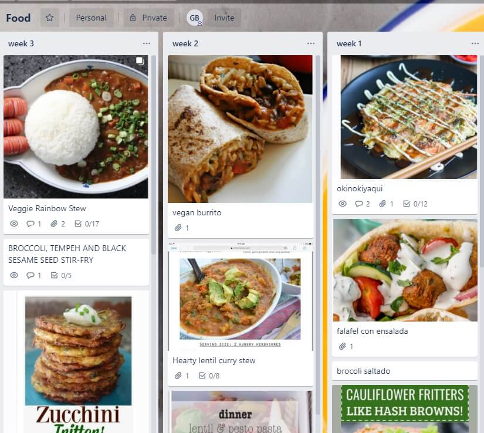
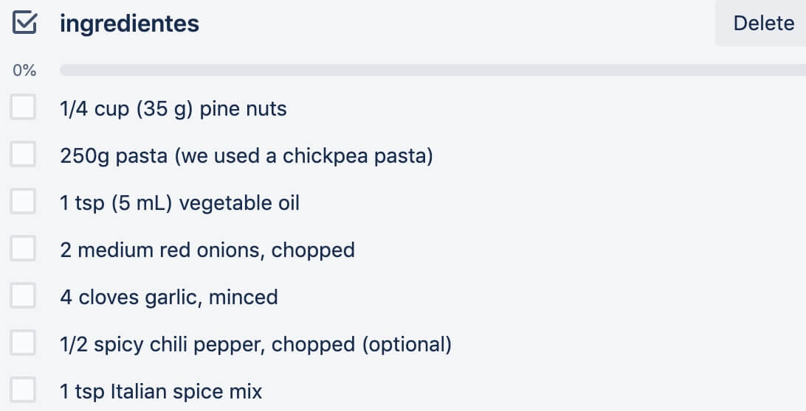
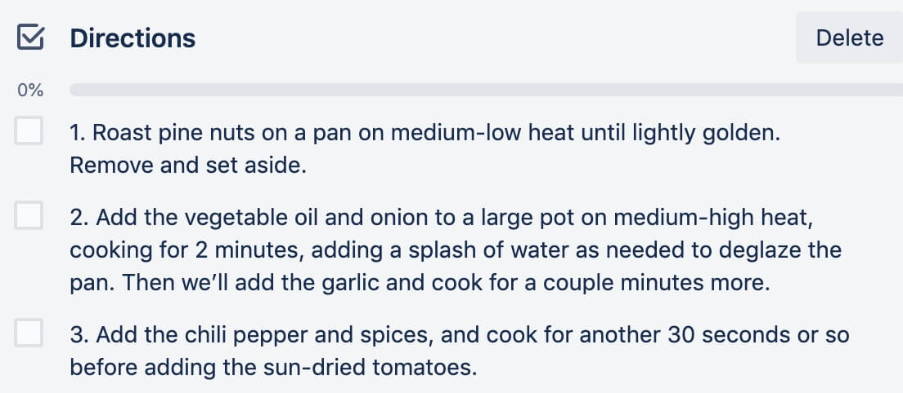

# COMO PLANEAR QUE COCINAR PARA LA SEMANA USANDO TRELLO

Uso  [Trello](https://trello.com/es)  para muchas cosas (como ya habrán visto en mi blog sobre viajes), últimamente uso Trello para planear el menu de la semana.

Lo primero es ir coleccionando la lista de los platos favoritos esos que puedes cocinar con los ojos cerrados.

Esta imagen es como divido en 3 semanas, y voy rotándolos.

### Porque planear lo que cocinaré

Debo admitir que para mí la peor parte de cocinar es pensar que cocinar, porque una vez que sé que cocinar el resto es fácil.  
He notado una gran diferencia cuando un día a la semana me siento frente a mi computadora y decido que cocinare para los siguientes 7 días esto acompañado con la lista de lo que debo comprar, en resumen hace mi vida mas fácil.

### Como usar Trello

Primero es listar los platos que cocino mas seguido; esta lista va creciendo en el tiempo, cuando veo una receta que puedo preparar, la adiciono con su foto, si veo un video en youtube un plato que me gusta, le tomo un screenshot y lo adiciono, lo importante es tener las imágenes de todos los platos.  
Tengo alrededor de 15 recetas que voy alternando, algunas son variantes de lo mismo … así que debo seguir trabajando en mas variedad

Screenshot de un video en youtube

Si hay la receta adiciono 2 checklist, si no no hay problema, por el momento lo importante es tener las fotos y los nombres;

Ingredientes :

y Direcciones

Los Martes planeo los platos que haré, porque Miercoles hago mis compras entonces es bueno tener la lista de lo que necesitare

Espero que este ejemplo de como uso Trello para planear mis recetas te de ideas de como tu puedes hacer lo mismo, no necesita ser la misma herramienta lo principal es tener una ayuda visual de los platos que puedes cocinar.