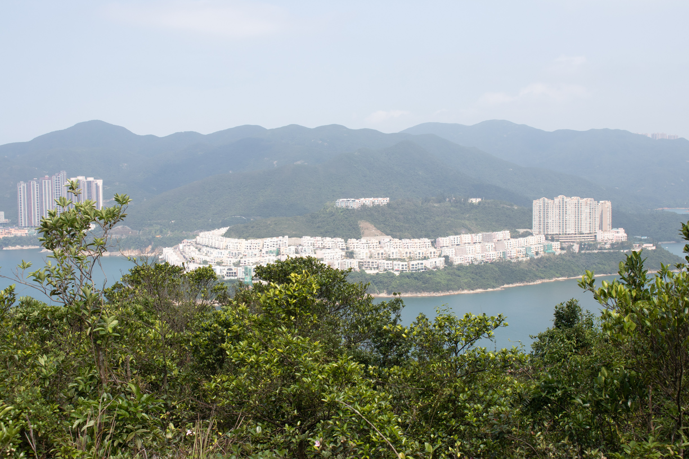
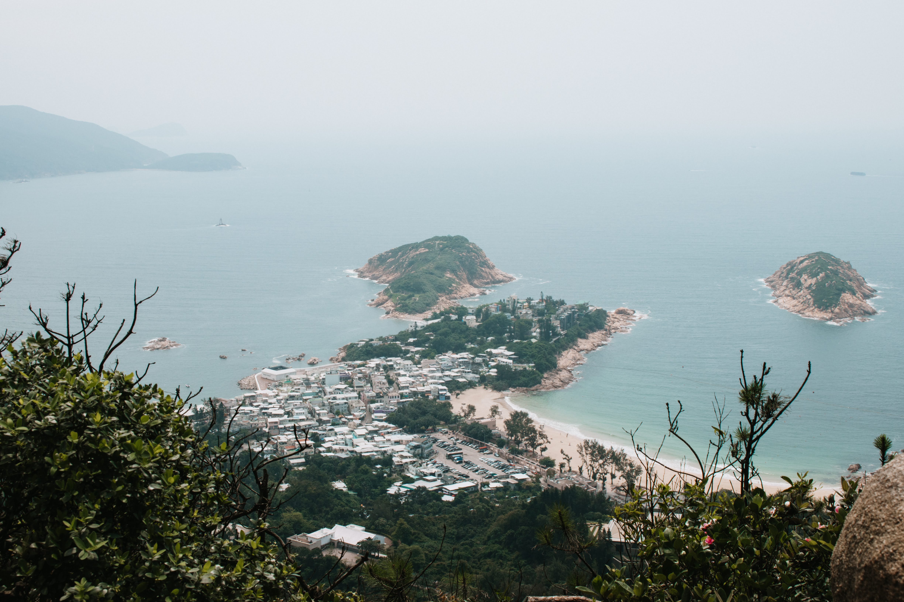
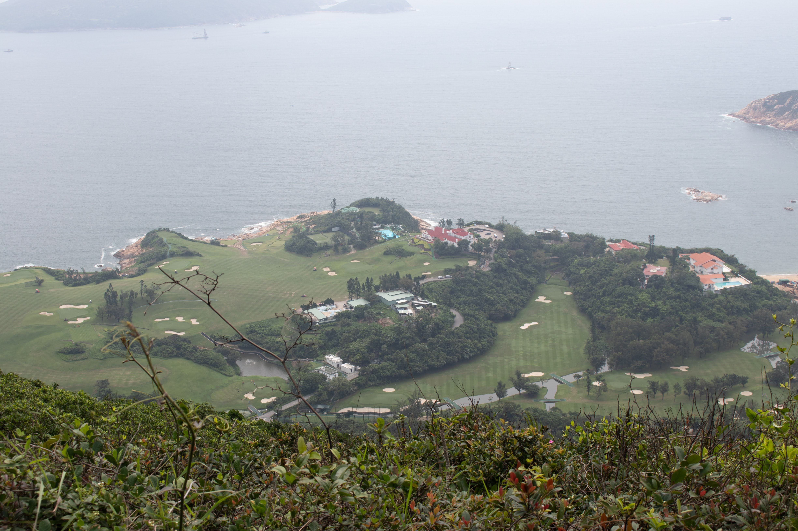
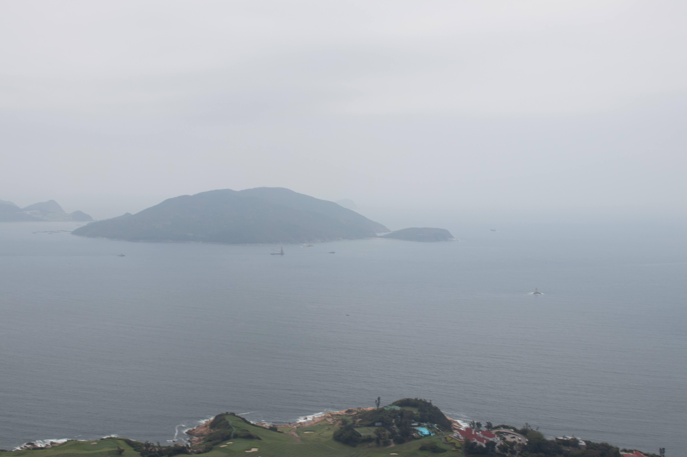

# Hong Kong - Caminata de la espalda del Dragón

Este año no se puede viajar y tengo mas tiempo en casa, he decidido combinar esos 2 factores y publicar mis post de viajes pasados, hoy voy a compartir una caminata que hice con mi hija en Hong Kong el año pasado, se llama Dragon's Back o "Espalda del Dragón", es bastante conocida, segura y se puede hacer en un par de horas.

## Como llegar a la caminata

La forma mas barata y fácil de ir es usando transporte publico, hay que tomar el **MTR a Shau Kei Wan MTR Station** y tomar la **Salida A3** para los buses **Shau Kei Bus Terminal**

Ahi hay que tomar el bus #9 que va a Cape D' Aguilar and Shek O, aquí les pongo la foto, esta es la parada inicial, verán muchas personas que harán la caminata también.

Hay que bajarse en Tei Wan Station (la parada numero 11) aquí es el inicio de la caminata, todo esta bien señalizado.

## Como hacer la caminata

Debo reconocer que no camino mucho, esta caminata no es muy larga pero si tiene subidas y bajadas así que no es del todo fácil.

- **Nivel de Dificultad:** yo diria que es de fácil a intermedio

- **Duración:** 3 hours

- **Distancia:** aproximado unos 8.5km

- **Que llevar :** zapatos de caminar, protección solar (gorros, lentes, crema para el sol), agua, comida, smartphone (para fotos y navegación), toalla y ropa de baño si piensan tomar un baño en la playa, nosotros no lo hicimos

## Comienzo de la caminata

Al bajar del bus comienza la caminata, hay baños públicos al inicio, todo esta bien señalizado, mucha vegetación y mariposas

Al inicio se sube escaleras hasta llegar a um mirador "View of Red Hill and Stanley Main Beach" a la izquierda

## Shek O Peninsula

Luego de seguir subiendo se llega a hermosas vistas de Shek o Peninsula a la izquierda o Este, incluyendo la pequeña isla : Island Bay

## Espalda del Dragón

Sigues caminando y llegas a la verdadera razón del nombre de la caminata porque estas sobre una montaña con ondulantes caminos que son la espalda del dragon, la vista es realmente hermosa a ambos lados, hay un campo de golf y una isla que parece una tortuga gigante, un mirador muy bonito

## Fin de la caminata

En este punto puedes regresar al lugar inicial y tomar el mismo bus de regreso al frente de donde nos dejó, será mas fácil porque es de bajada, la otra opción es continuar hasta una playa llamada : Big Wave

Nosotras decidimos no continuar con la playa salir a la pista y continuar con nuestro día en Hong Kong.

Les aconsejo esta caminata si tienen un par de horas libres en Hong Kong, algo diferente y con hermosas vistas, adicionalmente es seguro para hacerlo sola, este día hice la caminata con mi hija y nos gustó mucho.
