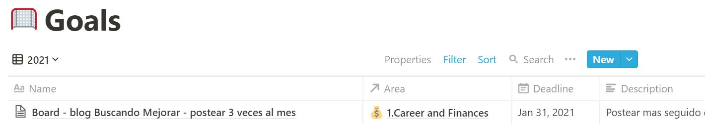
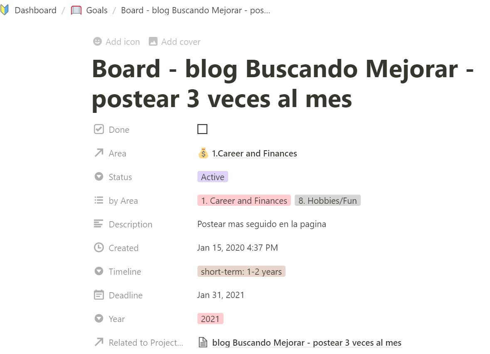
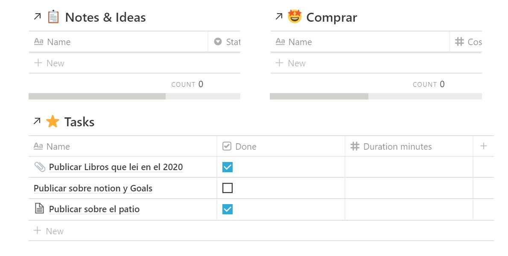

Hace un tiempo les conte que usaba Trello para organizar mi trabajo durante este año he cambiado a otra herramienta que es Notion.

Notion es gratis para uso personal, hay una curva de aprendisaje pero es mucho mas flexible. Aqui un ejemplo de como lo uso:

  

## Mis metas o resoluciones para este 2021.

Les mostrare como me organizo con notion, por ejemplo este año he decidido ponerme una meta para nuestro blog: Postear 3 veces por mes, es un gol medible, se puede alcanzar y por ejemplo hoy es 29 de Enero y tengo que terminar este post para cumplir con mi meta

## Como plantear metas

Esto lo saque de SMART goals, un acronimo para acordarse de estas 5 caracteristicas

 1. Especificos - tiene que ser una meta clara
 2. Tienen que ser cuantificables, al final del mes postee 3 posts o no
 3. Tiene que ser algo que me desafie y empuje a hacer, en este caso 3 posts, en pensar que voy a postear pero a la vez que sea algo que puedo lograr. 
 4. Realista - Debo ser honesta conmigo misma, antes posteaba 1 cada 3 o 4 meses, asi que hacer 3 en un mes esta todavia a prueba.   
 5. Deben tener un tiempo como referencia, en este ejemplo el mes como tiempo

 
## Proyecto
Cada meta puede tener mas de un proyecto en este caso o ejemplo la meta solo tiene un proyecto, pero como ven en este cuadro al ser un proyecto tengo notas y comprar, hay proyectos que requieren comprar algo y notas e ideas que puedo agregar al proyecto como links.

## Tareas
Son los pasos para conseguir mi meta, continuando con este ejemplo es escribir los 3 posts y publicarlos, con eso habre cumplido mi meta de Enero.
Este es mi primer mes de intento para mi meta de publicar 3 veces por mes, al final del año sabremos si lograre la meta :)
