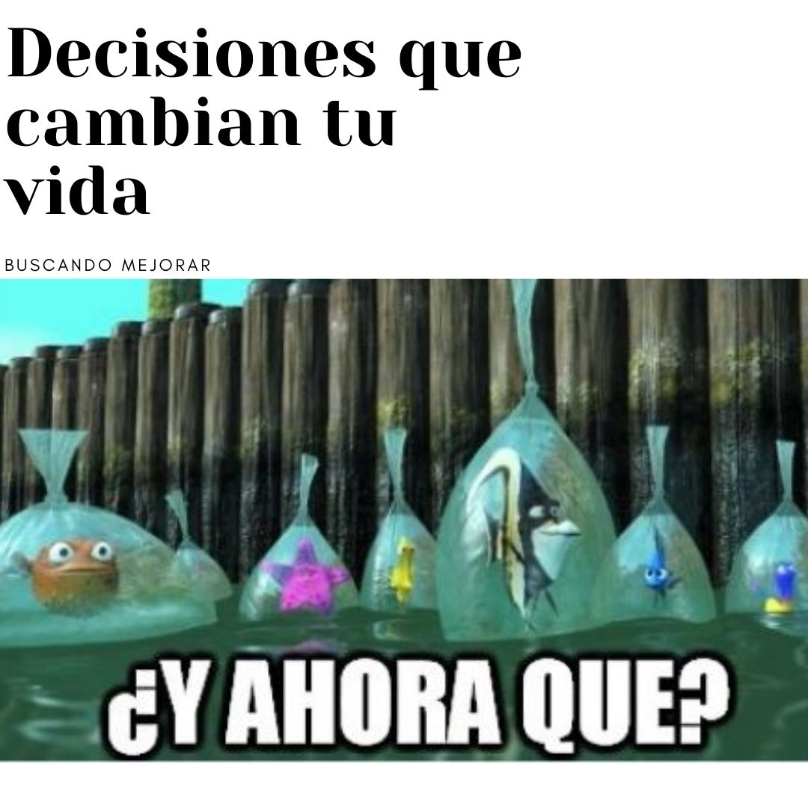
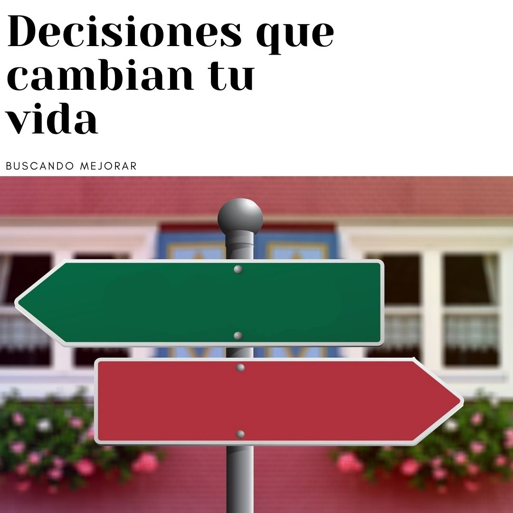

Estamos a punto de tomar una descisión importante, que afectará nuestro futuro y me estreso; quiero tenerlo todo, quiero que todo se mueva y que salga bien. Creo que es buen momento de reflexionar sobre el tema de decisiones.

## Venir a Australia

Recuerdo una decision importante fue cuando decidí venir a Australia a vivir, inicialmente cuando postule, todas mis fuerzas estaban en que me dieran la visa,mientras tanto hacia mi vida pero siempre con la idea de que tenia que hacer los papeles para postular, una vez que salió todo y me dijeron que si, luego de la alegria y emocion inicial, fue como la pelicula Nemo, cuando los pecesitos son libres y salen al mar, todos se miran y dicen y ahora que? ahi llego el momento de la Decisión.

## Momento de decidir

El siguiente paso fue decidir venir, dejarlo todo y venir a un pais que no conocia, dejar a todas las personas que quería y dejar mi vida, mi trabajo, amigos todo, por algo que habia soñado pero que no tenia la seguridad de como sería, ahí me dí cuenta de lo mucho que estaba agradecida con lo que tenía, fue un paso difícil, pero lo dí, el comenzar no fue fácil, otro idioma, buscar trabajo y poco a poco me fui acostumbrando, los años pasaron y ahora mi vida esta aqui.

## Que aprendi ?

1. Nunca vas a tener la seguridad de que te va a ir bien, siempre hay el riesgo, hay veces que tomaras malas decisiones; todo es parte del aprendisaje.
2. No todo lo que deseas se cumple, hay veces que la vida te da más pero no es exactamente lo que querias, hay que saber verlo.
3. Agradece por lo que tienes, talvez lo que tanto quieres, ya lo tienes y no te das cuenta.
4. Escucha a otros que han pasado por lo que tu estas pasando.
5. Escucha tu voz interna, en mi caso fue algo que siempre quise hacer, y una vez que se dió, me dio miedo de dejar todo, mi voz internam me dijo : Todo va a estar bien.

Hay veces que pienso que hubiera sido de mi si no hubiera decidido venir, no lo se, solo se que estoy feliz por esa decisión, talvez si me hubiera quedado hubiera llegado a las mismas conclusiones que llegue hoy.

