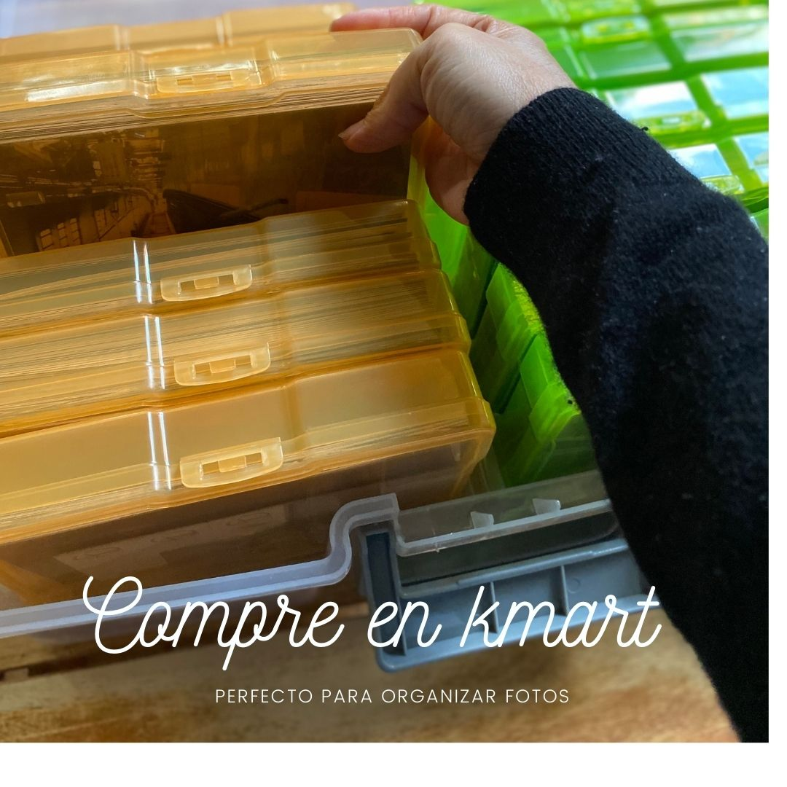

### Mi historia de Fotos

Me gusta tomar fotos, muuuchas fotos; tengo buena cantidad, claro ahora todo es digital a partir del año 2003 tengo camara digital, pero debo confesar que al inicio igual las imprimía, he impreso las fotos hasta el 2007 especialmente fotos de mi hija cuando era bebe, de ahi en adelante no he impreso mucho solo de agunos viajes he impreso libro de fotos, no fotos individuales. 

Bueno en resumidas cuentas tengo buena cantidad de fotos impresas, y no me quiero deshacer de ellas, las tenia guardadas en una caja de navidad y pesaba tanto que casi nunca la bajaba para ver mis fotos, hasta esta semana que encontre este organizador de fotos en kmart (una tienda australiana), era lo que tanto he estado esperando para organizar mis fotos.

Lo bueno es que puedo dividir las fotos en bloques una caja completa es mi viaje a Japón en 2002, el inicio de camaras digitales y querer imprimir todo

### Que dice el metodo de Konmari

Según el método de ordenar de Konmari es hacer lo sentimental al final, lo que es fotos y cosas sentimentales, es cierto uno al separar las fotos comienza a recordar y en lugar de organizar se convierte en recorday tal dia tal evento y uno se pierde, yo comenzé asi ... ahora que he dividido las fotos en sobres pequeños aun me falta mucho, tengo que ponerles una etiqueta, aunque mas o menos las tengo separadas por color pero aún asi necesitan etiquetas porque ahora me acuerdo pero en unos meses me habré olvidado.

### Digitalizar las que me faltan
Tengo planeado digitalizar el 100% de mis fotos, no voy a votar mis fotos impresas aun, cuando tenga nostalgia las vere y las vere nuevamente, pero mi idea es digitalizarlo todo, ya les contare que software usare y mi forma de organizar mis fotos en otro post.
