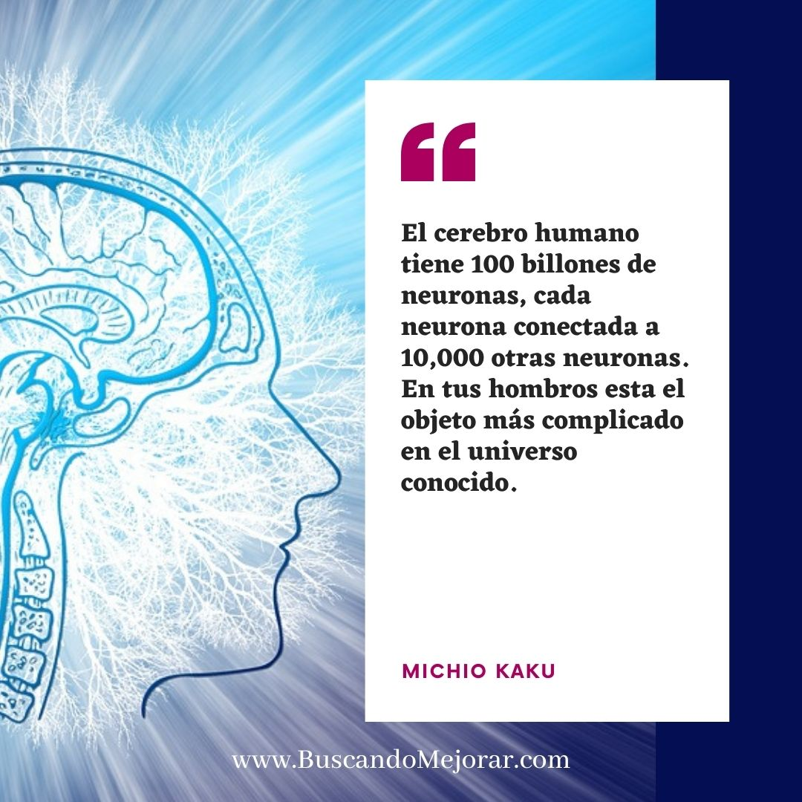

En los ultimos años tengo fascinación por libros que son del cuerpo humano, como funciona nuestro estómago, nuestro cerebro, inclusive me gusta el manga de cells at work que trata de nuestras celulas .
### Sin Limites - Limitless

Ahora estoy leyendo el libro Sin límites de Jim Kwik, quería hacer el resumen del libro para este post pero me quede sin tiempo así que haré un post de una idea que me ha quedado del libro hasta donde voy, un dicho de Michio Kaku que dice : el cerebro humano tiene 100 billones de neuronas, cada neurona conectada a 10,000 otras neuronas. En tus hombros esta el objeto más complicado en el universo conocido.

### Neuroplasticidad

Lo maravilloso de nuestro cerebro es que es flexible, cuando aprendes algo nuevo se adapta a los cambios a travez de las redes neuronales.  Es cuando instalas algo en tu telefono el software se actualiza.

Hay investigaciones que afirman que nuestro cerebro se comporta como un músculo mas que un disco duro ; porque? mientras mas lo usas se hace mas fuerte y mas información puede guardar.

Cada vez que aprendemos  las redes del cerebro cambian (neuroplasticidad) y mientras mas uses la memoria estas nuevos caminos creados se refuerzan. 

Cuando tenemos problemas con la memoria significa que estas conecciones se estan cortando, la memoria se puede entrenar, no somos robots es completamente normal olvidarse de algo pero lo importante es seguir aprendiendo, nunca se nos ha ensenado el arte de aprender.

### Consejor para mejorar la memoria

No soy una experta en la materia, al contrario soy una persona que con la edad estoy perdiendo mi vista y la memoria, leer este libro me da esperanzas que mi cerebro es maravilloso y solo necesito saber usarlo y ejercitarlo, aqui algunas sugerencias del libro

- Ejercicios de memoria, ejemplo trata de recordar telefonos de la gente que hablas seguido
- Cuando leo un libro, trato de hacer un resumen de lo que lei como por ejemplo lo que estoy haciendo ahora y lo bueno de tener mi blog es que lo puedo compartir con ustedes .
- Aprender algo nuevo no es imposible, es cuestion de motivación creo yo, si le pones esfuerzo puedes aprender cosas nuevas a cualquier edad.
- Memorizar es algo que se aprende, en el libro enseña técnicas de memorización, es importante contar o explicar a otros lo que uno aprende, es bueno hacer historias para memorizar una lista de cosas .
- Alimentacion es importante, el cerebro esta hecho de grasas, alimentos como la palta, salmon, blueberries, brocoli, turmeric, agua dan los nutrientes que el cerebro necesita.
- La importancia de los pequeños pasos, has lo que tienes al frente es importante.

Hay muchos mas consejos de este libro pero aún no lo he terminado así que podre postear mas sobre el tema, hay una parte de los sombreros para tomar desiciones que me parecio de mucha ayuda ya lo compartire con ustedes luego.
